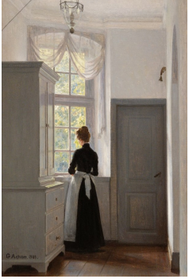
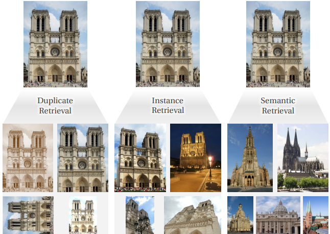
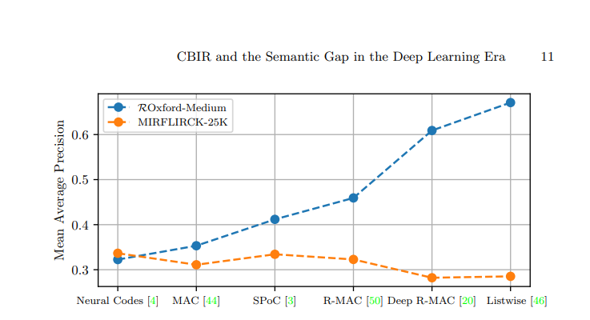

# Truy xuất hình ảnh dựa trên nội dung và khoảng cách ngữ nghĩa trong kỷ nguyên học sâu

**Björn Barz và Joachim Denzler**  
Nhóm Thị giác Máy tính, Đại học Friedrich Schiller Jena, Jena, Đức  
{bjoern.barz, joachim.denzler}@uni-jena.de

## Tóm tắt
Truy xuất hình ảnh dựa trên nội dung đã đạt được những tiến bộ đáng kinh ngạc trong thập kỷ qua, đặc biệt là đối với nhiệm vụ truy xuất hình ảnh của cùng một đối tượng được thể hiện trong ảnh truy vấn. Kịch bản này được gọi là truy xuất thể hiện hoặc truy xuất đối tượng và yêu cầu đối chiếu các mẫu hình ảnh chi tiết giữa các hình ảnh. Tuy nhiên, yếu tố ngữ nghĩa không đóng vai trò quan trọng.

Điều này đặt ra câu hỏi: Liệu những tiến bộ gần đây trong truy xuất thể hiện có thể chuyển giao sang các kịch bản truy xuất hình ảnh tổng quát hơn không?

Để trả lời câu hỏi này, trước tiên chúng tôi cung cấp một cái nhìn tổng quan ngắn gọn về những cột mốc quan trọng nhất của truy xuất thể hiện. Sau đó, chúng tôi áp dụng các phương pháp này vào một nhiệm vụ truy xuất hình ảnh ngữ nghĩa và nhận thấy rằng chúng hoạt động kém hiệu quả hơn nhiều so với các phương pháp ít phức tạp và mang tính tổng quát hơn trong bối cảnh yêu cầu hiểu hình ảnh. Tiếp theo, chúng tôi xem xét các phương pháp hiện có nhằm thu hẹp cái gọi là "khoảng cách ngữ nghĩa" bằng cách tích hợp kiến thức thế giới có sẵn.

Chúng tôi kết luận rằng vấn đề then chốt đối với sự tiến bộ hơn nữa của truy xuất hình ảnh ngữ nghĩa nằm ở việc thiếu một định nghĩa nhiệm vụ tiêu chuẩn hóa và bộ dữ liệu đánh giá thích hợp.

**Từ khóa:** Truy xuất hình ảnh dựa trên nội dung · Truy xuất thể hiện · Truy xuất đối tượng · Truy xuất hình ảnh ngữ nghĩa · Khoảng cách ngữ nghĩa
## 1. Giới thiệu

*"Người ta chỉ có thể nhìn rõ bằng trái tim. Điều cốt yếu thì vô hình đối với đôi mắt."*  
Câu nói nổi tiếng này của nhà văn Pháp **Antoine de Saint-Exupéry** áp dụng không chỉ cho cuộc sống mà còn cho cả lĩnh vực **thị giác máy tính**. Nhận thức của con người về hình ảnh vượt xa bề mặt thị giác bao gồm các điểm ảnh, màu sắc và các đối tượng. Ý nghĩa của một hình ảnh không thể chỉ được mô tả đơn giản bằng cách liệt kê tất cả các đối tượng có trong đó và xác định bố cục không gian của chúng.  

Chúng ta, với tư cách là con người, có khả năng nắm bắt vô vàn thông tin đa dạng và phức tạp chứa trong một hình ảnh chỉ trong nháy mắt, chẳng hạn như **các sự kiện đang xảy ra trong cảnh được thể hiện**, **các hoạt động mà con người đang thực hiện**, **mối quan hệ giữa họ**, **bầu không khí và tâm trạng của hình ảnh**, cũng như **cảm xúc mà nó truyền tải**. Nhiều khái niệm trong số này khó có thể mô tả bằng văn bản và thường được minh họa tốt nhất bằng cách cung cấp một hình ảnh ví dụ.

Ví dụ trong **Hình 1** minh họa sự đa dạng thông tin mà hình ảnh có thể truyền tải. Hình ảnh này có thể được mô tả từ nhiều góc độ khác nhau: **nội dung ngữ nghĩa**, **phong cách nghệ thuật**, **cảm xúc mà nó gợi lên cho người quan sát**, hoặc **thông tin siêu dữ liệu** về chính hình ảnh.  

Tùy thuộc vào **nền tảng** và **bối cảnh tình huống**, mỗi người quan sát sẽ nhận thức và diễn giải hình ảnh này theo một cách khác nhau. Do đó, việc **tìm kiếm hình ảnh trên web bằng mô tả văn bản hoặc từ khóa** thường thất bại, bởi hầu hết các hình ảnh **không được mô tả đầy đủ trong văn bản xung quanh**, vì hai lý do chính:

1. **Khó hoặc không thể** liệt kê rõ ràng tất cả các khía cạnh của một hình ảnh, do **số lượng cách diễn giải tiềm năng là vô hạn**.
2. **Không cần thiết phải mô tả toàn bộ**, bởi hầu hết thông tin có thể được người xem **hiểu ngay khi nhìn vào hình ảnh**.

Vì vậy, phần mô tả bằng văn bản thường chỉ tập trung vào **siêu dữ liệu không được mã hóa trực tiếp trong hình ảnh**, chẳng hạn như **tác giả** của nó.  
Ví dụ, hình ảnh trong **Hình 1** có thể chỉ được mô tả là *bản sao chụp của bức tranh “The Dream Window in the Old Liselund Castle” của Georg Achen*. Điều này sẽ **ngăn cản** hình ảnh được tìm thấy bởi những người đang tìm kiếm:

- Hình ảnh **người phụ nữ nhìn ra cửa sổ**,
- Hình ảnh thể hiện **hoạt động “mơ mộng”** (*daydreaming*),
- Hoặc hình ảnh có **bầu không khí u sầu**.

Do đó, cách tự nhiên, trực tiếp và **biểu đạt nhất** để tìm hình ảnh với một nội dung cụ thể — vốn có thể **phức tạp và khó định nghĩa** — là **sử dụng một hình ảnh mẫu làm truy vấn** thay vì từ khóa văn bản. Cách tiếp cận này được gọi là **truy xuất hình ảnh dựa trên nội dung (Content-Based Image Retrieval - CBIR)** [49] và đã trở thành một lĩnh vực nghiên cứu sôi nổi từ năm 1992 [31,36].

> “Hình ảnh phải được **nhìn nhận và tìm kiếm như chính nó**.”  
> — *Smeulders et al., 2000* [49], trong bài khảo sát toàn diện về **CBIR giai đoạn đầu**.

**Hình 2** minh họa ví dụ về ba tập hình ảnh khác nhau được truy xuất dựa trên cùng một ảnh truy vấn, nhưng phụ thuộc vào **loại nhiệm vụ CBIR**.

Trong hai thập kỷ kể từ khi Smeulders et al. công bố bài khảo sát năm 2000, lĩnh vực **truy xuất hình ảnh dựa trên nội dung (CBIR)** đã trải qua **ít nhất hai cuộc cách mạng lớn** (sẽ được trình bày chi tiết trong **Mục 2**). Tuy nhiên, hầu hết **các thách thức chính và hướng nghiên cứu trọng tâm** đã được xác định từ thời điểm đó.

Một trong những thách thức lớn này là **khoảng cách ngữ nghĩa (semantic gap)**, được Smeulders et al. định nghĩa như sau:

> *“Khoảng cách ngữ nghĩa là sự thiếu trùng khớp giữa thông tin có thể được trích xuất từ dữ liệu hình ảnh và sự diễn giải mà người dùng gán cho dữ liệu đó trong một tình huống cụ thể.”*  
> — [49, Mục 2.4]

Diễn giải theo cách nói của **de Saint-Exupéry**, **khoảng cách ngữ nghĩa** là **sự khác biệt giữa việc nhìn nhận một hình ảnh bằng đôi mắt** — khách quan, chỉ như là tập hợp các **đối tượng, hình dạng, kết cấu** — và **nhìn nhận bằng trái tim**, chủ quan hơn, bao gồm **kiến thức về thế giới, cảm xúc và các yếu tố tiềm ẩn “giữa các điểm ảnh”**.

---

## Mức độ trừu tượng và khoảng cách ngữ nghĩa
Kích thước của khoảng cách ngữ nghĩa phụ thuộc vào **mức độ trừu tượng** của mục tiêu tìm kiếm mà người dùng đang theo đuổi.  
Smeulders et al. [49] định nghĩa mức độ này **trên một thang liên tục** từ **miền hẹp** đến **miền rộng**.  

Điều này có thể được minh họa thông qua **ba loại nhiệm vụ CBIR phổ biến nhất hiện nay**, được trình bày trong **Hình 2**:

### 1. **Duplicate Retrieval (Truy xuất trùng lặp)**
Tìm kiếm các hình ảnh **có nội dung hoàn toàn giống nhau**, nhưng có thể đã được **xử lý hậu kỳ** khác nhau, ví dụ:
- Cắt xén (cropping),
- Thay đổi kích thước (scaling),
- Điều chỉnh màu sắc, độ sáng, độ tương phản, v.v.

Đây là **loại nhiệm vụ đơn giản nhất**, vì nội dung hình ảnh không thay đổi về mặt ngữ nghĩa, chỉ khác nhau về hình thức.

### 2. **Instance Retrieval (Truy xuất thể hiện)**
Tìm kiếm hình ảnh **miêu tả cùng một thể hiện cụ thể của một đối tượng**, ví dụ:
- Một **người cụ thể**,
- Một **tòa nhà cụ thể**.

Đây là **nhiệm vụ được nghiên cứu nhiều nhất** trong CBIR nhờ:
- Bản chất **rõ ràng, có ground-truth chính xác** nhưng không quá tầm thường.
- Có nhiều **bộ dữ liệu chuẩn hóa** để đánh giá, ví dụ: [28,39,40,43].

Trong những năm gần đây, đã có **những bước tiến lớn** trong lĩnh vực này (sẽ được trình bày chi tiết trong **Mục 2**).

### 3. **Semantic Retrieval (Truy xuất ngữ nghĩa)**
Bao phủ **phần còn lại của phổ nhiệm vụ** — rộng hơn instance retrieval, mục tiêu là **tìm các hình ảnh thuộc cùng một "danh mục" (category)** với ảnh truy vấn.

> **Lưu ý:** Trong bối cảnh này, *category* **không nhất thiết** phải là lớp đối tượng (object class).

Thực tế:
- **Tập hợp các category chỉ bị giới hạn bởi trí tưởng tượng của người dùng.**
- **Một hình ảnh thường thuộc về rất nhiều category cùng lúc** (xem lại **Hình 1**).

Vì vậy:
- **Mục tiêu tìm kiếm chính xác** thường **không thể xác định** chỉ dựa trên ảnh truy vấn.
- Và **gần như chắc chắn sẽ khác nhau giữa các người dùng**, ngay cả khi truy vấn là giống nhau.

Do đó, **các phương pháp giải quyết vấn đề này** thường phải **tương tác với người dùng** để **điều chỉnh thước đo độ tương đồng** của hệ thống sao cho **phù hợp với suy nghĩ của người dùng** [55,12,15,5,7].

---

## Ý nghĩa và tầm quan trọng của việc học biểu diễn hình ảnh
Việc **học các biểu diễn hình ảnh có ý nghĩa**, có thể nắm bắt được:
- Các **phân biệt ngữ nghĩa tinh tế**,
- Và **các khía cạnh đa dạng của ý nghĩa hình ảnh**,

là **vô cùng quan trọng**.  
Tuy nhiên:
- **Truy xuất ngữ nghĩa** vẫn nhận được **ít sự quan tâm hơn** so với **truy xuất thể hiện**.
- Nguyên nhân chính:
  1. Khái niệm **“liên quan”** và **“tương đồng”** ít được định nghĩa rõ ràng.
  2. Thiếu **bộ dữ liệu benchmark phù hợp**.

Trong bài nghiên cứu này:
- Chúng tôi sẽ **đánh giá các phương pháp mới nhất cho truy xuất ngữ nghĩa** (xem **Mục 4**),
- Và **đánh giá trạng thái hiện tại của khoảng cách ngữ nghĩa**, **20 năm** sau giai đoạn "CBIR sơ khai".

---

## Mối quan hệ giữa ba loại nhiệm vụ CBIR
- **Duplicate Retrieval** nằm **ở đầu phổ nhiệm vụ** (miền hẹp nhất).  
  - **Khoảng cách ngữ nghĩa gần như không tồn tại.**
  - Chỉ cần định nghĩa **danh sách các bất biến** (invariances) như xoay, cắt xén, v.v.

- **Instance Retrieval** khó hơn Duplicate Retrieval,  
  - Nhưng vẫn có thể **giải quyết bằng cách đối chiếu các mẫu trực quan chi tiết và bố cục hình học**.

- **Semantic Retrieval** có **miền rộng nhất**,  
  - Yêu cầu nhiều hơn chỉ là so khớp mẫu hình ảnh.

Theo **Smeulders et al. [49]**, để **thu hẹp khoảng cách ngữ nghĩa**, cần **tích hợp các nguồn thông tin ngữ nghĩa bên ngoài hình ảnh**.

---

## Tóm tắt hướng nghiên cứu
- **Mục 2:** Tóm tắt các tiến bộ trong Instance Retrieval hai thập kỷ qua.  
- **Mục 3:** Trình bày hạn chế của các kỹ thuật hiện tại khi áp dụng vào Semantic Retrieval.  
- **Mục 4:** Xem xét các hướng tích hợp thông tin ngữ nghĩa bên ngoài hình ảnh.  
- **Mục 5:** Thảo luận những yếu tố còn thiếu để **tiến xa hơn trong CBIR miền rộng**.

## 2. Sự phát triển của Instance Retrieval

Trong giai đoạn từ năm 2000 đến 2020, CBIR — với trọng tâm đặc biệt là *instance retrieval* — đã trải qua hai lần chuyển đổi lớn:  
- Lần đầu tiên bắt đầu vào năm 2003 [48], được khởi xướng bởi việc thích ứng và cải tiến các kỹ thuật từ lĩnh vực tìm kiếm văn bản.  
- Làn sóng đột phá thứ hai bắt nguồn từ việc ứng dụng các phương pháp học sâu vào CBIR, bắt đầu từ năm 2014 [4,45].  

Chúng tôi sẽ phác thảo các cột mốc chính của hai giai đoạn đổi mới này trong phần sau.

---

### 2.1 Đặc trưng thủ công và Từ trực quan (Visual Words)

#### Đặc trưng cục bộ như Từ trực quan
Năm 2003, Sivic và Zisserman [48] tìm cách phát hiện sự xuất hiện của một đối tượng cụ thể trong video và, để làm điều này, họ đã thích ứng mô hình mô tả tài liệu **bag-of-words (BoW)** — vốn phổ biến trong lĩnh vực tìm kiếm văn bản — sang bài toán tìm kiếm ảnh.  

- **Tương tự như văn bản**:  
  - "Từ" được thay bằng **đặc trưng cục bộ** tại các điểm nổi bật (keypoints) trong ảnh.  
  - Các đặc trưng này được **lượng tử hóa** thành một **từ vựng “từ trực quan”** bằng thuật toán **k-Means**.  
  - Giống như văn bản, số lần xuất hiện của các từ trực quan trong ảnh được đếm và tổng hợp thành một **vector tf-idf** biểu diễn toàn bộ hình ảnh.  
  - Vì khoảng cách Euclidean không có ý nghĩa trong không gian chiều cao, nên **độ tương đồng cosin** được sử dụng để đo độ giống nhau giữa hai ảnh.  

Quy trình này minh họa khung tổng quát cho việc trích xuất biểu diễn ảnh, được sử dụng trong CBIR từ thời điểm đó cho đến nay [30]:  
1. **Bộ trích xuất đặc trưng cục bộ** tính toán đặc trưng tại các keypoints trong ảnh.  
2. Các đặc trưng cục bộ này sau đó được ánh xạ (embedding) sang một không gian khác, chẳng hạn như chỉ số của từ trực quan.  
3. Cuối cùng, chúng được tổng hợp thành **biểu diễn toàn cục** (global representation).  

Biểu diễn toàn cục cho phép tìm kiếm hiệu quả một danh sách ban đầu các ảnh ứng viên. Ngoài ra, đặc trưng cục bộ thường được sử dụng để thực hiện **kiểm tra không gian (spatial verification)** và bước **xếp hạng lại (re-ranking)** cho các ứng viên xếp hạng cao nhằm loại bỏ những kết quả khớp sai [48,39].  
Kỹ thuật này khá đặc thù cho instance retrieval, vì nó so khớp các vector đặc trưng cục bộ giữa ảnh truy vấn và ảnh tìm được để xác minh rằng chúng có bố cục hình học tương ứng.

---

#### Hướng tới các phép nhúng phức tạp hơn
Các công trình sau đó trong giai đoạn này chủ yếu tập trung vào việc cải tiến bước **embedding và aggregation**, trong khi vẫn sử dụng cùng một bộ trích xuất đặc trưng cục bộ trong suốt một thập kỷ.  

- **Hessian-affine detector** [34] thường được sử dụng để tìm ra các keypoints, tức các điểm đặc trưng bất biến với phép biến đổi affine cũng như bền vững trước những thay đổi nhỏ về ánh sáng và góc nhìn.  
- Các keypoints này sau đó được mô tả bằng **SIFT** [33] hoặc **RootSIFT** [1].  
  - RootSIFT chỉ là một phép biến đổi đơn giản của SIFT: chuẩn hóa L1 vector SIFT rồi lấy căn bậc hai từng phần tử.  
  - Trong không gian kết quả, khoảng cách Euclidean giữa các vector RootSIFT tương ứng với một **kernel so khớp histogram** trong không gian SIFT.  

Trong nghiên cứu của Sivic và Zisserman [48], phép nhúng (embedding) sẽ biến mỗi vector đặc trưng cục bộ thành một vector chỉ mục one-hot của từ vựng với trọng số tf-idf.

---

#### Các phương pháp nhúng tiên tiến hơn

Việc gộp đặc trưng (aggregation) trong BoW ban đầu chỉ đơn giản là phép **cộng tổng**.  
Tuy nhiên, việc biểu diễn vector đặc trưng cục bộ chỉ bằng **một số nguyên** (chỉ số cụm) đã gây mất mát thông tin nghiêm trọng và không phản ánh đúng phân bố thực tế của các đặc trưng cục bộ.  
Việc **gán cứng (hard assignment)** một đặc trưng vào duy nhất một cụm cũng không bền vững trước những thay đổi nhỏ khi descriptor nằm gần ranh giới cụm.  

Để khắc phục, **Perronnin et al. [38]** đề xuất sử dụng **Fisher Vector** cho CBIR:  
- Dữ liệu huấn luyện được lượng tử hóa thành các từ trực quan bằng cách **fit một mô hình Gaussian Mixture Model (GMM)**.  
- Mỗi vector đặc trưng cục bộ được biến đổi thành **gradient của log-likelihood** đối với trung bình của các Gaussian.  
- Cách này thực hiện một **soft assignment có trọng số** đến các cụm, tạo ra descriptor đặc hơn, nhiều thông tin hơn, nhưng cũng có **chiều rất cao**.  
- Kết quả: chỉ với **1 từ trực quan**, Fisher Vector đã đạt hiệu năng tương đương với BoW có **4.000 từ**.  

---

Một cách đơn giản hơn nhưng hiệu quả ngang bằng (thậm chí vượt trội trong một số trường hợp) là **VLAD (Vectors of Locally Aggregated Descriptors)**, được đề xuất bởi **Jégou et al. [29]**:  
- VLAD vẫn dùng **hard assignment** (mỗi descriptor gán vào cụm gần nhất).  
- Tuy nhiên, thay vì chỉ lưu chỉ số cụm, VLAD ghi nhận **vector phần dư (residuals)** giữa descriptor và tâm cụm.  
- Cấu trúc vector nhúng: được chia thành **k đoạn**, với k là số cụm.  
  - Đoạn ứng với cụm gần nhất = hiệu giữa descriptor và tâm cụm.  
  - Các đoạn khác = 0.  
- Kích thước embedding = **(số cụm) × (kích thước descriptor cục bộ)**.  
- Sau khi cộng dồn tất cả vector phần dư, kết quả được **chuẩn hóa L2**, rồi **giảm chiều bằng PCA kèm whitening**, đưa descriptor toàn cục về mức có thể xử lý (vài trăm chiều).

---

VLAD, về định nghĩa, rất nhạy với **khoảng cách Euclidean** giữa descriptor và tâm cụm.  
Tuy nhiên, khoảng cách Euclidean trong không gian cao chiều thường **không còn ý nghĩa**.  
Trong một nghiên cứu tiếp theo, **Jégou và Zisserman [30]** đã đề xuất:  
- **Chuẩn hóa L2 các residuals**, để mã hóa **góc (angle)** thay vì độ lớn.  
- Cách này được gọi là **Triangulation Embedding**.  
- Vì khoảng cách Euclidean kém ý nghĩa, nên gán cứng (hard assignment) cũng không hợp lý.  
- Triangulation embedding thay vào đó mã hóa góc giữa descriptor và **tất cả các từ trực quan**.  
- Biểu diễn này sau đó được whitening và cho thấy **hiệu năng vượt trội hơn Fisher Vector và VLAD**.

---

Tuy vậy, **Husain và Bober [25]** chỉ ra rằng:  
- Việc so sánh mỗi descriptor với **tất cả từ trực quan** không thể mở rộng cho các tập dữ liệu lớn.  
- Gán mềm (soft assignment) thì thường không ổn định và trong thực tế thường suy thoái thành gán cứng.  

Để giải quyết, họ đề xuất một giải pháp trung gian gọi là **Robust Visual Descriptors (RVDs)**:  
- Gán descriptor vào **một vài cụm gần nhất** thay vì tất cả.  
- Trọng số dựa trên **thứ hạng (rank) trong số hàng xóm gần nhất**, chứ không dựa trên khoảng cách tuyệt đối.  
- Các descriptor này không được whitening toàn cục, mà **whitening riêng trên từng cụm**.  
- Kết quả: RVD có hiệu năng cạnh tranh với triangulation embedding, nhưng **tính toán nhanh hơn** và **bền vững hơn khi giảm chiều**.
### 2.2 Học sâu (Deep Learning)

#### Sự xuất hiện của đặc trưng học sâu
Năm 2014 đánh dấu một bước ngoặt lớn đối với CBIR khi **mạng nơ-ron tích chập (CNNs)** bắt đầu được áp dụng.  
- Thay vì dựa vào đặc trưng thủ công (SIFT, RootSIFT, v.v.), các nhà nghiên cứu khai thác **biểu diễn từ mạng học sâu** đã được huấn luyện cho các nhiệm vụ nhận dạng hình ảnh quy mô lớn.  
- Các đặc trưng từ những lớp trung gian của CNN cho thấy khả năng biểu diễn mạnh mẽ, bền vững trước biến đổi hình học và ngữ cảnh, vượt xa những gì đặc trưng thủ công đạt được.  

---

#### Biểu diễn toàn cục từ CNN
Một trong những cách tiếp cận đầu tiên là **trích xuất trực tiếp vector đặc trưng từ các lớp fully-connected** của CNN huấn luyện trên ImageNet.  
- Các vector này được dùng như **biểu diễn toàn cục** của ảnh.  
- Tuy nhiên, chúng thường **thiếu tính bất biến không gian**, do đó chưa phù hợp hoàn toàn với instance retrieval.  

Để cải thiện, các nghiên cứu tiếp theo tận dụng **đặc trưng từ các lớp tích chập (convolutional layers)**:  
- Các lớp này sinh ra **map đặc trưng không gian (spatial feature maps)** thay vì chỉ một vector cố định.  
- Từ đó, các kỹ thuật tổng hợp như:  
  - **Max pooling**  
  - **Sum pooling**  
  - **R-MAC (Regional Maximum Activations of Convolutions)**  
được đề xuất để tạo vector biểu diễn toàn cục có tính bất biến cao hơn.  

---

#### Học end-to-end cho Instance Retrieval
Sau giai đoạn tận dụng CNN huấn luyện sẵn, nghiên cứu chuyển sang hướng **huấn luyện end-to-end chuyên biệt cho retrieval**.  
- Mục tiêu: tối ưu trực tiếp không gian đặc trưng sao cho phù hợp với nhiệm vụ so khớp ảnh.  
- Các kỹ thuật then chốt:  
  - **Triplet loss** và **Contrastive loss**: buộc các ảnh giống nhau gần nhau hơn, ảnh khác nhau bị đẩy xa ra.  
  - **Fine-tuning** trên dữ liệu retrieval thay vì chỉ sử dụng dữ liệu phân loại.  

---

#### Học sâu kết hợp với xác minh không gian
Mặc dù CNN mang lại biểu diễn toàn cục mạnh mẽ, nhiều nghiên cứu vẫn kết hợp với **xác minh không gian (spatial verification)** và **re-ranking** dựa trên đặc trưng cục bộ để cải thiện độ chính xác cuối cùng.  

---

#### Tóm lại
Trong giai đoạn **2014–2020**, học sâu đã:  
- Thay thế gần như hoàn toàn đặc trưng thủ công.  
- Mang đến biểu diễn ảnh giàu ngữ nghĩa, bất biến tốt và hiệu quả hơn.  
- Mở ra các hệ thống **retrieval end-to-end** hiện đại, trong đó toàn bộ pipeline (từ trích xuất đặc trưng đến truy vấn) được mạng nơ-ron tối ưu trực tiếp.
### Vai trò của các tập dữ liệu  

Trong khi mô hình sử dụng **đặc trưng cục bộ được tổng hợp** cho CBIR đã có từ năm 2003 [48], thì nghiên cứu trong lĩnh vực này lại sôi động nhất trong giai đoạn **2010 đến 2016**. Một lý do có thể giải thích cho sự chậm trễ này là do **thiếu các tập dữ liệu chuẩn mực và phù hợp** để làm benchmark.  

Trong các năm **2007 và 2008**, ba tập dữ liệu **Oxford Buildings** [39], **Paris Buildings** [40], và **INRIA Holidays** [28] đã được công bố. Chúng nhanh chóng trở thành **benchmark tiêu chuẩn** cho bài toán truy hồi theo thực thể (instance retrieval) và tạo động lực mới cho lĩnh vực này, nhờ cung cấp một cơ sở rõ ràng để đánh giá và so sánh các phương pháp.  

- **Oxford Buildings** và **Paris Buildings**: bao gồm các bức ảnh khác nhau của nhiều công trình kiến trúc nổi tiếng ở Oxford và Paris, với sự đa dạng lớn về góc chụp, tỷ lệ và mức độ che khuất.  
- **Holidays dataset**: bao gồm bộ sưu tập ảnh du lịch cá nhân, trung bình có khoảng **3 góc nhìn khác nhau cho mỗi cảnh**.  

Mặc dù các tập dữ liệu này khá **thách thức**, nhưng nhiệm vụ truy hồi ảnh hiển thị **cùng một đối tượng hoặc cảnh** với truy vấn lại được **xác định rõ ràng với ground truth minh bạch**.  
Tuy nhiên, các tập dữ liệu này cũng bộc lộ một số hạn chế:  
- **Kích thước nhỏ**: mỗi tập chỉ chứa vài nghìn ảnh, dẫn đến nguy cơ **overfitting** khi huấn luyện các mô hình phức tạp.  
- **Phạm vi hạn chế**: chủ yếu tập trung vào ảnh công trình kiến trúc hoặc cảnh quan cụ thể, không bao quát được sự đa dạng của các đối tượng trong thế giới thực.  
- **Độ khó chưa đủ lớn**: mặc dù thách thức, nhưng quy mô và độ đa dạng chưa phản ánh đúng độ phức tạp của các hệ thống truy hồi hình ảnh hiện đại.  

Để giải quyết những vấn đề này, các tập dữ liệu **lớn hơn và đa dạng hơn** đã lần lượt ra đời:  
- **Google Landmarks Dataset (GLD)** [2018, 2019]: bao gồm hàng triệu hình ảnh của hàng trăm nghìn địa danh trên toàn thế giới, thu thập từ Internet. Đây là một bước tiến quan trọng, vì nó cho phép huấn luyện và đánh giá các mô hình học sâu ở **quy mô lớn thực sự**.  
- Các tập dữ liệu mở rộng khác được thiết kế nhằm thúc đẩy **học biểu diễn sâu (deep representation learning)** và tăng tính **khả chuyển (transferability)** của mô hình sang nhiều bối cảnh thực tế hơn.  

Sự ra đời của các tập dữ liệu này đã mở đường cho **làn sóng thứ hai của CBIR** dựa trên **deep learning** từ năm 2014, đồng thời tiếp tục đóng vai trò nền tảng cho những cải tiến mới trong giai đoạn gần đây.  
### 2.2 Các đặc trưng CNN được đào tạo sẵn

Sau hơn một thập kỷ thống trị mà không bị thách thức, vị thế của các đặc trưng cục bộ được tạo thủ công trong CBIR cuối cùng đã chứng kiến một sự thay đổi đáng kể trong cách biểu diễn hình ảnh nhờ sự trỗi dậy của học sâu.

Các nghiên cứu độc lập của Babenko và cộng sự [4] và Razavian và cộng sự [45] lần đầu tiên chứng minh rằng có thể đạt được kết quả tốt đáng kinh ngạc chỉ bằng cách trích xuất các bộ mô tả hình ảnh toàn cục, được gọi là **mã thần kinh**, từ lớp kết nối đầy đủ đầu tiên của một mạng CNN được đào tạo trước trên ImageNet [14]. Với sự đơn giản tối giản của phương pháp này, hầu như không đòi hỏi nỗ lực kỹ thuật so với việc phát hiện điểm đặc trưng then chốt, trích xuất các đặc trưng cục bộ và tổng hợp chúng, đây là một kết quả đáng chú ý.

Chỉ một năm sau, Babenko và Lempitsky [3] đã cải thiện đáng kể hiệu suất của phương pháp này bằng cách trích xuất các đặc trưng hình ảnh không phải từ một lớp kết nối đầy đủ mà từ lớp tích chập cuối cùng, lớp này vẫn giữ được độ phân giải không gian. Kết quả là một tập hợp các vectơ đặc trưng có thể được ánh xạ gần đúng đến các vùng khác nhau trong hình ảnh. Các vectơ này sau đó được tổng hợp (sum-pooled), chuẩn hóa L2, giảm chiều bằng PCA, và một lần nữa được chuẩn hóa L2, để tạo ra các bộ mô tả được đặt tên rõ ràng là **SPoC** (Sum-Pooled Convolutional features).

Trong những năm tiếp theo, nghiên cứu chủ yếu tập trung vào việc sử dụng các bộ trích xuất đặc trưng thần kinh được đào tạo sẵn và thiết kế các hàm tổng hợp tinh vi. Nhiều phương pháp trong số đó cố gắng tìm điểm chung giữa tổng hợp trung bình (sum pooling) và tổng hợp tối đa (max pooling), ví dụ: bằng cách lấy trung bình các kích hoạt trên một vài phản hồi hàng đầu như trong **PMP** (Partial Mean Pooling) [54] hoặc bằng cách nội suy trơn tru giữa hai thái cực như trong **GeM** (Generalized Mean Pooling) [42].

Tuy nhiên, các đặc trưng tích chập được tổng hợp có một nhược điểm: Không giống như các đặc trưng cục bộ truyền thống, chúng không cho phép định vị chính xác các đối tượng khớp nhau và do đó không tương thích với các kỹ thuật như xác minh không gian và xếp hạng lại, vốn phụ thuộc vào thông tin hình học.

Để đạt được mục tiêu này, Tolias và cộng sự [50] đã đề xuất phương pháp **R-MAC** (Regional Maximum Activation of Convolutions), một quy trình gồm hai bước:
- Bản đồ đặc trưng tích chập được chia thành các vùng chồng chéo với các kích thước khác nhau.
- Các vectơ đặc trưng cục bộ trong mỗi vùng được tổng hợp bằng phương pháp gộp tối đa (max-pooled).

Các vectơ đặc trưng cục bộ này (được gọi là vectơ MAC) sau đó được làm trắng (whitened) và được tổng hợp lại (sum-pooled) thành một bộ mô tả hình ảnh toàn cục duy nhất là R-MAC. Đối với việc xếp hạng lại không gian, độ tương đồng giữa vectơ MAC của ảnh truy vấn và các vectơ MAC vùng riêng lẻ của một số kết quả truy xuất hàng đầu có thể được sử dụng để định vị đối tượng trong truy vấn trong các ảnh được truy xuất và để tinh chỉnh thứ hạng kết quả.

Các kỹ thuật này đã đưa CBIR dựa trên các đặc trưng được trích xuất từ các CNN được đào tạo sẵn tiến một bước rất dài, mặc dù các bộ mô tả thủ công như **RVD** [25] vẫn có khả năng cạnh tranh với chúng trên các điểm chuẩn truy xuất theo thể loại (instance retrieval benchmarks).
### 2.3 Học từ đầu đến cuối cho Truy xuất Hình ảnh

Học sâu cuối cùng đã trở nên vượt trội không thể phủ nhận so với các kỹ thuật CBIR truyền thống dựa trên các đặc trưng thủ công khi các nhà nghiên cứu bắt đầu điều chỉnh CNN được sử dụng để trích xuất đặc trưng cho nhiệm vụ truy xuất hình ảnh thay vì sử dụng mạng được đào tạo sẵn. Chúng tôi coi sự thay đổi trọng tâm từ chuyển đổi và tổng hợp đặc trưng sang học đặc trưng thực tế là sự thay đổi mô hình quan trọng thứ hai trong CBIR.

**Đặc trưng Toàn cục**  
Gordo và cộng sự [20] là một trong những người đầu tiên thành công trong nỗ lực này và thiết lập trạng thái nghệ thuật trong truy xuất thể loại ít nhất hai năm. Họ xây dựng dựa trên R-MAC [50] và triển khai nó dưới dạng các lớp khả vi trên kiến trúc CNN VGG16, sau đó có thể được đào tạo từ đầu đến cuối. Để làm được điều này, họ sử dụng hàm mất mát triplet [47], một mục tiêu đào tạo từ lĩnh vực học metric sâu. Bằng cách đào tạo trên một tập dữ liệu được tuyển chọn gồm các địa danh nổi tiếng, họ học được một biểu diễn đặc trưng trong đó các hình ảnh của cùng một địa danh ở gần nhau hơn một ngưỡng nhất định so với hai hình ảnh của các địa danh khác nhau, điều này hỗ trợ mục tiêu của truy xuất thể loại.

Phương pháp này sau đó đã được mở rộng bằng cách trích xuất các đặc trưng R-MAC từ nhiều lớp của CNN và trọng số các đặc trưng riêng lẻ của mỗi vùng bằng độ phân kỳ Kullback-Leibler giữa các phân phối của khoảng cách Euclid giữa các bộ mô tả khớp và không khớp, sao cho các đặc trưng vùng phân biệt hơn có trọng số cao hơn [26]. Động lực để kết hợp các đặc trưng từ nhiều lớp nằm ở các mức độ trừu tượng hóa hình ảnh khác nhau: các đặc trưng từ các lớp đầu tiên chỉ ra nhiều hơn các thuộc tính hình ảnh, trong khi các lớp sau cung cấp một biểu diễn trừu tượng hơn về mặt ngữ nghĩa.

Trái ngược với hàm mất mát triplet, Radenović và cộng sự [42] nhận thấy hàm mất mát tương phản mang lại hiệu suất cuối cùng tốt hơn, đồng thời chỉ yêu cầu các cặp thay vì bộ ba hình ảnh để đào tạo. Quan trọng hơn, họ đề xuất một kỹ thuật không giám sát để tạo dữ liệu đào tạo gồm các cặp hình ảnh khớp và không khớp cho truy xuất thể loại mà không cần chú thích của con người: Các hình ảnh trong tập dữ liệu đào tạo được phân cụm dựa trên biểu diễn BoW của chúng bằng cách sử dụng các đặc trưng RootSIFT cục bộ và xác minh không gian được áp dụng để đảm bảo rằng tất cả các hình ảnh trong một cụm hiển thị cùng một đối tượng. Sau đó, một mô hình 3-D được xây dựng cho mỗi cụm bằng cách sử dụng kỹ thuật structure-from-motion (SfM), để từ các mô hình này có thể xác định được hai hình ảnh có mô tả cùng một đối tượng hay không. Điều này cũng cho phép các hình ảnh của cùng một địa danh nhưng được chụp từ các góc nhìn khác nhau và rời rạc được coi là không khớp. Thông tin về vị trí máy ảnh thu được từ SfM hơn nữa cho phép khai thác các cặp hình ảnh tích cực đầy thách thức có lượng chồng chéo đáng kể.

Các phương pháp học metric này đã dẫn đến một sự cải thiện ấn tượng về hiệu suất truy xuất thể loại về độ chính xác trung bình (AP), mặc dù chúng không tối ưu hóa nó trực tiếp mà là một mục tiêu ủy quyền dựa trên khoảng cách trong không gian đặc trưng đã học. Vì AP là số liệu quan trọng nhất để đánh giá các phương pháp truy xuất, nên việc tối ưu hóa nó trực tiếp thay vì một tác vụ ủy quyền có vẻ mong muốn. Tuy nhiên, điều đó đòi hỏi phải tính đến không chỉ một mẫu đơn lẻ, một cặp hoặc một bộ ba như trước đây, mà toàn bộ danh sách kết quả được xếp hạng. Một lợi ích rõ ràng là các mục tiêu theo danh sách như vậy nhạy cảm với vị trí: Tác động của một cặp hoặc bộ ba đơn lẻ liên quan đến các hình ảnh ở đầu bảng xếp hạng nên cao hơn so với cuối danh sách. Tuy nhiên, độ chính xác trung bình không khả vi, vì nó liên quan đến việc sắp xếp các hình ảnh theo độ tương đồng với truy vấn. Để có thể tối ưu hóa AP trong bối cảnh học từ đầu đến cuối, He và cộng sự [22] đã đề xuất một phép xấp xỉ khả vi của AP bằng cách sử dụng phân bin histogram, phương pháp này đã được Revaud và cộng sự [46] áp dụng cho CBIR và cải thiện trạng thái nghệ thuật. Vì độ tương đồng cosine, thường được sử dụng để truy xuất, bị giới hạn trong [-1, 1], nên phạm vi của các điểm tương đồng có thể dễ dàng được chia thành một số lượng cố định các bin có kích thước bằng nhau. Sau đó, các hình ảnh được gán mềm vào các bin có trung tâm gần nhất với điểm truy xuất của hình ảnh để thu được histogram của số lượng khớp tích cực và tiêu cực trong mỗi bin. Thay vì tính toán độ chính xác và độ nhớ lại cho mỗi vị trí có thể có trong bảng xếp hạng, các số liệu này giờ đây có thể được tính toán cho mỗi bin và kết hợp để xấp xỉ AP.

Tuy nhiên, việc lượng tử hóa điểm tương đồng thành các bin bỏ qua các biến thể của thứ hạng trong mỗi bin, điều này có thể có tác động đặc biệt lớn đến AP ở các vị trí đầu của bảng xếp hạng. Nhược điểm này gần đây đã được khắc phục bằng một cách tiếp cận khác để xấp xỉ AP: Thay vì sắp xếp lượng tử hóa bằng phân bin, chính thao tác sắp xếp được làm mềm bằng cách thay thế hàm bước Heaviside chỉ ra liệu một phần tử của danh sách có đứng trước phần tử khác hay không bằng một hàm sigmoid để tránh tiêu biến gradient [41]. Điều này cho phép sắp xếp khả vi và tính toán một phiên bản làm mịn của AP, được gọi là Smooth-AP [9].

Với các phương pháp tiếp cận theo danh sách này, các biểu diễn toàn cục cho CBIR cuối cùng có thể được học từ đầu đến cuối mà không cần các bước trung gian thủ công hoặc các mục tiêu ủy quyền.

**Đặc trưng Cục bộ**  
Trong khi các bộ mô tả hình ảnh toàn cục thuận tiện cho các ứng dụng truy xuất, chúng không mạnh mẽ khi có sự che khuất hoặc nhiễu nền cũng như không phù hợp để xác minh không gian, một kỹ thuật quan trọng cho truy xuất thể loại. Do đó, các công trình khác nhằm mục đích học các bộ phát hiện và mô tả đặc trưng cục bộ một cách từ đầu đến cuối.

Ví dụ, Deep Local Features (DELF) [37] sử dụng các đặc trưng vùng thô được trích xuất từ một lớp tích chập của CNN được đào tạo trước và sau đó đào tạo một CNN nhỏ khác để đánh giá tầm quan trọng của các điểm đặc trưng được lấy mẫu dày đặc này. Để đào tạo, các trọng số dự đoán này được sử dụng để tổng hợp có trọng số (weighted sum pooling) các bộ mô tả cục bộ thành một vectơ đặc trưng toàn cục, cho phép tinh chỉnh các đặc trưng cục bộ bằng cách sử dụng giám sát ở cấp độ hình ảnh.

Hầu hết các hệ thống truy xuất thể loại sử dụng đặc trưng cục bộ áp dụng phương pháp tiếp cận hai giai đoạn: Đầu tiên, một tập hợp các hình ảnh ứng viên được truy xuất bằng cách so sánh các đặc trưng toàn cục và sau đó được xếp hạng lại bằng cách sử dụng xác minh không gian dựa trên các đặc trưng cục bộ. Cao và cộng sự [10] đã thống nhất việc học cả hai loại đặc trưng thành một mô hình duy nhất với hai nhánh: Một nhánh tổng hợp tất cả các vectơ đặc trưng của lớp tích chập cuối cùng của CNN thành các vectơ đặc trưng toàn cục và được đào tạo với một hàm mất mát học metric. Nhánh còn lại học một mô-đun chú ý để xác định các đặc trưng cục bộ đặc trưng và được đào tạo bằng cách sử dụng cross-entropy phân loại.

**Nhu cầu về các Điểm chuẩn Đầy thách thức hơn**  
Bên cạnh nhiều năng lực tính toán, các kỹ thuật học sâu đòi hỏi một điều quan trọng nhất: dữ liệu. Các tập dữ liệu truy xuất thể loại hiện có quá nhỏ để đào tạo các mạng nơ-ron sâu, do đó Babenko và cộng sự [4] đã tạo ra một tập dữ liệu địa danh mới với hơn 200.000 hình ảnh cho mục đích đào tạo, tập dữ liệu này sau đó cũng được sử dụng bởi các công trình khác về truy xuất hình ảnh sâu [20]. Ngày nay, tập dữ liệu quy mô lớn Google-Landmarks [37] được đề xuất vào năm 2017 thường được sử dụng để đào tạo. Nó bao gồm hơn một triệu hình ảnh của 12.894 địa danh từ khắp nơi trên thế giới.

Các tập dữ liệu này lớn hơn nhiều lần so với tập dữ liệu Oxford và Paris Buildings, nhưng các tập dữ liệu sau vẫn có liên quan để đánh giá và so sánh các phương pháp mới. Tuy nhiên, những tiến bộ nhanh chóng trong học sâu cho CBIR nhanh chóng dẫn đến sự bão hòa hiệu suất trên các điểm chuẩn này. Do đó, Radenović và cộng sự [43] đã xem xét lại hai tập dữ liệu này vào năm 2018 bằng cách cải thiện các chú thích ground-truth, tìm kiếm các truy vấn khó hơn, thêm các hình ảnh đánh lạc hướng đầy thách thức và xác định ba giao thức đánh giá khác nhau với các mức độ khó khác nhau.

Những phát triển này chứng minh tầm quan trọng của các tập dữ liệu đào tạo và điểm chuẩn phù hợp cho sự tiến bộ của truy xuất hình ảnh dựa trên nội dung.
### 3 Tác động đến Khoảng cách Ngữ nghĩa

Phần trước đã phác thảo những tiến bộ ấn tượng của truy xuất thể loại trong kỷ nguyên học sâu. Tuy nhiên, truy xuất thể loại là một lĩnh vực khá hẹp, nơi không yêu cầu hiểu biết rộng về ngữ nghĩa cảnh để giải quyết tác vụ một cách thỏa đáng. Do đó, câu hỏi thú vị là: Liệu những tiến bộ này có chuyển sang lĩnh vực rộng hơn của truy xuất ngữ nghĩa không?

Để trả lời câu hỏi này, chúng tôi đánh giá một số phương pháp và mô hình quan trọng trên một tác vụ truy xuất thể loại và một tác vụ truy xuất ngữ nghĩa. Đối với truy xuất thể loại, chúng tôi sử dụng tập dữ liệu Revisited Oxford Buildings [39,43] (xem ở trên), nơi các phương pháp này ban đầu được đánh giá. Để chỉ ra hiệu suất của chúng trong một lĩnh vực rộng hơn, chúng tôi đánh giá chúng trên tập dữ liệu MIRFLICKR-25K [24], bao gồm 25.000 hình ảnh từ Flickr, mỗi hình ảnh được chú thích với một tập hợp con của 25 khái niệm như "bầu trời", "hồ", "hoàng hôn", "phụ nữ", "chân dung", v.v. Trong khi hầu hết các hình ảnh trong tập dữ liệu được chú thích với nhiều hơn một khái niệm, 3.054 hình ảnh trong số đó chỉ có một nhãn duy nhất. Chúng tôi sử dụng những hình ảnh này làm truy vấn để tránh sự mơ hồ của truy vấn. Chúng tôi coi một hình ảnh được truy xuất là có liên quan nếu nó chia sẻ khái niệm này.

Hình 3 mô tả độ chính xác trung bình (mean average precision) của một số cột mốc quan trọng trong nghiên cứu CBIR trong kỷ nguyên học sâu trên cả hai tác vụ. Trong khi hiệu suất trên các tác vụ truy xuất thể loại tăng lên đều đặn, hiệu suất truy xuất ngữ nghĩa không những không cải thiện mà thậm chí còn suy giảm nhẹ. Phần lớn các phát triển trong những năm qua tập trung vào truy xuất thể loại và do đó điều chỉnh các biểu diễn đặc trưng hướng tới tác vụ này, nơi các đặc trưng hình ảnh mức độ chi tiết (fine-grained) là quan trọng. Tuy nhiên, điều này làm giảm hiệu suất của chúng trên các tác vụ miền rộng hơn, vốn đòi hỏi một tập hợp các đặc trưng khác.

Trong khi truy xuất thể loại đã đạt đến mức độ trưởng thành rất cao trong 20 năm qua, truy xuất hình ảnh dựa trên nội dung nói chung vẫn đang đối mặt với những thách thức của khoảng cách ngữ nghĩa.
### 4 Tích hợp Tri thức cho Truy xuất Hình ảnh Ngữ nghĩa

Một cách để vượt qua khoảng cách ngữ nghĩa là tích hợp các nguồn thông tin bổ sung bên ngoài hình ảnh, như Smeulders và cộng sự [49] đã đề cập từ năm 2000. Trong phần sau, chúng tôi xem xét ngắn gọn các nguồn thông tin bên ngoài phổ biến nhất cũng như các phương pháp tận dụng chúng để cải thiện biểu diễn hình ảnh cho truy xuất hình ảnh ngữ nghĩa.

#### 4.1 Nhãn Lớp

Nhãn lớp ở cấp độ hình ảnh là một trong những loại thông tin ngữ nghĩa về hình ảnh có sẵn thường xuyên nhất và rẻ nhất. Tuy nhiên, để đạt được hiệu suất mạnh mẽ trong một thế giới mở, cần phải có một số lượng lớn các lớp hoặc phương pháp luận tinh vi vượt ra ngoài việc đào tạo một bộ phân lớp đơn giản.

OASIS [11] kết hợp cả hai: Về phương pháp, OASIS học một metric tương đồng song tuyến tính bằng cách sử dụng hàm mất mát triplet để so sánh các đặc trưng thủ công với sự tương đồng ngữ nghĩa của hình ảnh. Tập dữ liệu đào tạo bao gồm hơn hai triệu hình ảnh được lấy từ Google Image Search bằng khoảng 150.000 truy vấn văn bản do người dùng thực nhập. Làm việc tại Google, các tác giả không chỉ có quyền truy cập vào các truy vấn này mà còn có các đánh giá mức độ liên quan dựa trên số liệu nhấp chuột, cho phép họ thu thập tập dữ liệu quy mô lớn nhưng không công khai này.

Với sự xuất hiện của học sâu, Yu và cộng sự [53] khai thác biểu diễn phân cấp nội tại được tạo bởi CNN bằng cách kết hợp các đặc trưng từ các lớp nông và sâu. Trong khi các đặc trưng trước đó chủ yếu nắm bắt các mẫu hình ảnh, các đặc trưng từ các lớp sâu hơn được kỳ vọng sẽ trừu tượng hơn và mang thông tin ngữ nghĩa. Mặc dù vậy, họ chỉ đánh giá phương pháp của mình trên các điểm chuẩn truy xuất thể loại.

Các phương pháp gần đây hơn tối ưu hóa CNN trực tiếp cho nhiều tác vụ để học các biểu diễn đa dạng. Ví dụ, MultiGrain [8] nhằm mục đích học các đặc trưng hữu ích cho nhận dạng ở cấp độ lớp, cấp độ thể loại và cấp độ danh tính bằng cách kết hợp mục tiêu phân loại và học metric. Tuy nhiên, việc đánh giá được thực hiện riêng biệt cho từng tác vụ về độ chính xác phân loại trên ImageNet [14] và độ chính xác truy xuất trên các điểm chuẩn truy xuất thể loại. Giao thức đánh giá này không cung cấp thông tin về hiệu suất truy xuất ngữ nghĩa.

Để triển khai CBIR ở cấp độ sản xuất trong công cụ tìm kiếm Microsoft Bing, Hu và cộng sự [23] sử dụng một tập hợp lớn các kiến trúc mạng khác nhau được đào tạo cho các tác vụ khác nhau: để phân loại với hàm mất mát cross-entropy, với mục tiêu học metric như hàm mất mát tương phản hoặc triplet, để nhận dạng khuôn mặt hoặc để phát hiện đối tượng. Tập hợp này nhằm mục đích nắm bắt nhiều đặc tính hình ảnh và ngữ nghĩa của hình ảnh và do đó, bao phủ hầu hết các mục tiêu mà người dùng công cụ tìm kiếm hình ảnh có thể theo đuổi. Dữ liệu đào tạo cho hệ thống này không công khai và được thu thập bởi các người chú thích trong một nỗ lực thu thập và chú thích dữ liệu tốn kém. Việc đánh giá cũng được thực hiện bằng cách sử dụng đánh giá mức độ liên quan của con người. Vì hai lý do này, công trình này không thể tái tạo công khai cũng như không thể so sánh trực tiếp với các công trình khác.

#### 4.2 Phân loại Lớp

Các nhãn lớp đơn thuần không tính đến mối quan hệ ngữ nghĩa giữa các lớp. Mặc dù có sự tương đồng về hình ảnh, các hình ảnh về con người và vượn thường được coi là ít tương đồng về mặt ngữ nghĩa hơn nhiều so với hình ảnh của một con sâu bướm và một con bướm, mặc dù hai loài sau không đặc biệt giống nhau từ góc độ hình ảnh. Các hệ thống phân loại như WordNet [16] là một công cụ phổ biến để đo lường mức độ tương đồng ngữ nghĩa giữa các lớp. Chúng tổ chức các khái niệm ở các cấp độ trừu tượng khác nhau theo mối quan hệ "là một" ("một con chó poodle là một con chó là một con vật, v.v."). Một số công trình phấn đấu tích hợp tri thức tiên nghiệm này về thế giới để cải thiện tính nhất quán ngữ nghĩa của kết quả CBIR.

Deng và cộng sự [13] xây dựng một thước đo tương đồng song tuyến tính thủ công từ hệ thống phân loại lớp của ImageNet [14] và sử dụng nó để so sánh các vectơ xác suất lớp được dự đoán bởi một bộ phân lớp. Thay vì một thước đo tương đồng, Barz và Denzler [6] xây dựng một không gian đặc trưng ngữ nghĩa được tạo ra bởi các embedding lớp,nơi độ tương đồng cosine giữa hai embedding lớp bằng với độ tương đồng ngữ nghĩa của chúng được suy ra từ hệ thống phân loại. Sau đó, họ sử dụng một CNN để ánh xạ các hình ảnh vào cùng một không gian ngữ nghĩa. Arponen và Bishop [2] không ràng buộc không gian đặc trưng theo cách tường minh như vậy, mà thay vào đó tích hợp cùng một mục tiêu trực tiếp vào hàm mất mát, để bố cục của không gian đặc trưng ngữ nghĩa được học. Họ kết hợp điều này với một thành phần bổ sung khuyến khích các đặc trưng riêng lẻ là nhị phân, cho phép tạo ra các bộ mô tả nhỏ gọn và hiệu quả về bộ nhớ.

Các công trình được đề cập ở trên đánh giá phương pháp của họ trên ImageNet bằng cách sử dụng "độ chính xác phân cấp" [13], phương pháp này thay thế mức độ liên quan nhị phân của kết quả truy xuất được sử dụng bởi độ chính xác thông thường bằng độ tương đồng ngữ nghĩa của lớp của chúng và lớp của truy vấn. Số liệu này phù hợp hơn với tác vụ, nhưng được vẽ tốt nhất cho một số vị trí cắt trong bảng xếp hạng và không thể dễ dàng được tóm tắt thành một con số duy nhất để tạo điều kiện so sánh.

Yang và cộng sự [52] kết hợp độ tương đồng ngữ nghĩa và hình ảnh bằng cách đầu tiên xếp hạng hình ảnh theo độ tương đồng ngữ nghĩa và sau đó sắp xếp các hình ảnh trong cùng một lớp theo độ tương đồng hình ảnh với truy vấn. Để làm được điều này, họ sử dụng hàm mất mát tương phản với một biên độ thích ứng tỷ lệ thuận với độ không tương đồng. Tuy nhiên, việc đánh giá chỉ giới hạn ở các tập dữ liệu phân loại chi tiết (fine-grained) và được thực hiện bằng cách sử dụng mức độ liên quan nhị phân, điều này không tính đến ngữ nghĩa.

Long và cộng sự [32] không chỉ nhúng các lớp mà tất cả các khái niệm trong hệ thống phân loại vào một không gian hyperbolic, sao cho các lớp con nằm trong vùng kéo theo (entailment cone) của lớp cha của chúng. Như trước đây, một CNN sau đó được sử dụng để ánh xạ các mẫu lên các embedding lớp của chúng. Mặc dù phương pháp của họ cũng có thể được áp dụng để truy xuất hình ảnh dựa trên nội dung, họ tập trung vào truy xuất video và chỉ đánh giá phương pháp của mình trên tác vụ đó.
#### 4.3 Mô tả Văn bản

Trong khi các hệ thống phân loại cung cấp thông tin về độ tương đồng ngữ nghĩa giữa các lớp, ý nghĩa ngữ nghĩa đầy đủ của chúng vượt xa hơn thế. Một số công trình nhằm mục đích trích xuất ngữ nghĩa phong phú như vậy từ các mô tả văn bản của các lớp hoặc hình ảnh và tận dụng chúng để học các đặc trưng hình ảnh có ý nghĩa. Ví dụ, DeViSE [17] và HUSE [35] học các embedding từ trên Wikipedia và sử dụng embedding của tên một lớp làm embedding ngữ nghĩa của nó. DeViSE [17] sau đó ánh xạ các hình ảnh vào không gian đó bằng cách tối đa hóa độ tương đồng tích vô hướng giữa vectơ đặc trưng của chúng và embedding lớp tương ứng, đồng thời thiết lập một khoảng cách tối thiểu nhất định đến bất kỳ embedding lớp nào khác. Ngược lại, HUSE [35] áp dụng phương pháp tối ưu hóa theo cặp bằng cách buộc khoảng cách của các cặp hình ảnh phải bằng với độ không tương đồng của các embedding lớp của chúng. Cách tiếp cận này cung cấp tính linh hoạt cao hơn đối với không gian đặc trưng hình ảnh được học vì nó tách biệt với không gian embedding từ. Giống như một số phương pháp tiếp cận dựa trên phân cấp được mô tả ở trên, cả hai phương pháp đều được đánh giá bằng độ chính xác phân cấp. Do đó, thông tin ngữ nghĩa được sử dụng để đánh giá không giống với thông tin được sử dụng để đào tạo, điều này gây bất lợi so với các phương pháp dựa trên phân cấp.

Thay vì sử dụng văn bản liên quan đến các lớp, các phương pháp khác tận dụng văn bản thuộc về các hình ảnh riêng lẻ, chẳng hạn như tiêu đề và chú thích, và học một không gian embedding đa phương thức. Gomez và cộng sự [19] thực hiện điều này bằng cách đào tạo một CNN để hồi quy các embedding văn bản được tạo bởi một mô hình ngôn ngữ được đào tạo riêng. Tuy nhiên, họ chỉ đánh giá phương pháp của mình với các truy vấn văn bản và không phải trong kịch bản truy xuất hình ảnh dựa trên nội dung. Ngược lại, Wu và cộng sự [51] học embedding văn bản và hình ảnh đồng thời và bổ sung dự đoán các embedding riêng lẻ cho các thành phần của chú thích như đối tượng, cặp thuộc tính-đối tượng và cụm từ quan hệ-đối tượng. Các thành phần ngữ nghĩa này tự động được căn chỉnh với các đặc trưng cục bộ của các vùng hình ảnh tương ứng bằng cách sử dụng học tương phản. Tuy nhiên, các thí nghiệm của họ chỉ điều tra các kịch bản truy xuất chéo phương thức hình ảnh-to-chú thích và chú thích-to-hình ảnh, trong khi hiệu suất CBIR ngữ nghĩa không được phân tích.
#### 4.4 Phong cách Nghệ thuật

Một khía cạnh hoàn toàn khác của ngữ nghĩa hình ảnh được mở ra bởi các khái niệm phong cách như phong cách nghệ thuật, tâm trạng và bầu không khí. Việc học các đặc trưng hình ảnh tôn trọng các thuộc tính như vậy đòi hỏi phải có chú thích chuyên biệt hoặc kiến thức tiên nghiệm về đặc điểm của chúng.

Ha và cộng sự [21] định nghĩa phong cách theo thành phần màu sắc, tức là sự phân bố và bố cục màu sắc trong một hình ảnh. Họ xây dựng một tập dữ liệu với các đánh giá độ tương đồng chủ quan 5 sao cho các cặp hình ảnh, được thu thập thông qua một quá trình crowdsourcing công phu có sự tham gia của học tập tích cực. Một mạng siamese được đào tạo để dự đoán phân phối của các đánh giá độ tương đồng cho một cặp hình ảnh nhất định.

Để tránh việc thu thập tốn kém các tập dữ liệu phong cách quy mô lớn, Gairola và cộng sự [18] dựa vào kiến thức từ lĩnh vực chuyển đổi phong cách hình ảnh, nơi các đặc trưng ma trận Gram được phát hiện là nắm bắt được các thuộc tính phong cách của hình ảnh. Họ trích xuất các đặc trưng này từ một CNN được đào tạo trước, phân cụm chúng và sử dụng nhãn cụm làm ground-truth để đào tạo một CNN khác bằng hàm mất mát triplet. Họ đánh giá phương pháp của mình trên nhiều tập dữ liệu được chú thích với các phong cách nghệ thuật, phong cách nhiếp ảnh, phong cách nghệ thuật lịch sử, tâm trạng hoặc thể loại.

### 5 Thành phần Còn thiếu

Hai hướng nghiên cứu về truy xuất thể loại và truy xuất ngữ nghĩa được mô tả lần lượt trong Phần 2 và 4 cho thấy một điểm khác biệt rõ rệt: Nghiên cứu về truy xuất thể loại cho thấy sự tiến bộ liên tục có thể đo lường được nhờ các tập dữ liệu điểm chuẩn Oxford [39] và Paris [40], mà việc phát hành của chúng đã được theo sau bởi một làn sóng nghiên cứu rõ rệt trong lĩnh vực này. Với tập dữ liệu Google-Landmarks [37], dữ liệu đào tạo đầy đủ có sẵn cho các phương pháp học sâu hiện đại. Bản sửa đổi gần đây của hai tập dữ liệu điểm chuẩn nói trên [43] duy trì tính hữu ích của chúng như một điểm chuẩn bất chấp những cải tiến hiệu suất đáng kể.

Ngược lại, các công trình hiện có về truy xuất hình ảnh ngữ nghĩa rất khác nhau về giao thức đánh giá, dữ liệu đào tạo (một số trong đó là mã nguồn đóng) và ngay cả định nghĩa vấn đề, khiến việc so sánh rõ ràng giữa các phương pháp là không thể. Đây có lẽ là trở ngại lớn nhất cho sự tiến bộ hơn nữa trong lĩnh vực này và có lẽ là lý do tại sao nghiên cứu vẫn tập trung vào truy xuất thể loại.
### 5 Thành phần Còn thiếu (Tiếp theo)

Do đó, một tập dữ liệu điểm chuẩn được quản lý kỹ lưỡng cho truy xuất hình ảnh ngữ nghĩa sẽ đóng góp rất lớn vào việc thúc đẩy lĩnh vực này. Tuy nhiên, việc xây dựng một điểm chuẩn như vậy là rất phi thường do nhiều khía cạnh. Điều này bắt đầu ngay từ số liệu đánh giá. Trong kịch bản CBIR ngữ nghĩa, độ chính xác thường quan trọng hơn độ nhớ lại, vì hầu hết người dùng không quan tâm đến tất cả các hình ảnh có liên quan tiềm năng từ một cơ sở dữ liệu quy mô lớn. Do đó, độ chính xác trung bình là một thước đo dưới mức tối ưu, nhưng chỉ riêng độ chính xác là không đủ, vì nó chỉ xem xét mức độ liên quan nhị phân. Tuy nhiên, trong thực tế, mức độ liên quan là một hiện tượng phân loại [49]. Một ứng cử viên cho số liệu đánh giá là normalized discounted cumulative gain (NDCG) [27], có thể tính đến mức độ liên quan giữa hai hình ảnh. Tuy nhiên, tập dữ liệu cũng cần cung cấp các xếp hạng mức độ liên quan như vậy cho mỗi cặp truy vấn và hình ảnh được truy xuất. Lý tưởng nhất, mức độ liên quan nên dựa trên xếp hạng của người dùng thực, điều này đòi hỏi một nỗ lực chú thích lớn.

Hơn nữa, điểm chuẩn nên xác định một tập hợp các tiêu chí liên quan đa dạng mà người dùng có thể có trong đầu khi sử dụng hệ thống CBIR, bao gồm danh tính thể loại, danh tính danh mục đối tượng ở các cấp độ trừu tượng khác nhau, sự tương đồng về phong cách nghệ thuật, tâm trạng, cảm xúc, hành động và mối quan hệ được mô tả trong hình ảnh. Các phức tạp khác được gây ra bởi thực tế là một hình ảnh truy vấn duy nhất có thể được diễn giải khác nhau đối với mỗi chiều trong số này. Do đó, mức độ liên quan của một hình ảnh được truy xuất không chỉ phụ thuộc vào truy vấn mà còn phụ thuộc vào mục tiêu tìm kiếm mà người dùng theo đuổi. Sự mơ hồ này chỉ có thể được giải quyết bằng cách tương tác với người dùng hoặc bằng cách cung cấp nhiều hình ảnh truy vấn chia sẻ khía cạnh liên quan. Do đó, điểm chuẩn lý tưởng nên cung cấp các giao thức đánh giá khác nhau, một giao thức tương tác và một giao thức không tương tác, có thể được giới hạn ở các truy vấn ít mơ hồ hơn. Kịch bản tương tác hơn nữa đòi hỏi phải xác định một giao thức mô phỏng phản hồi.

### 6 Kết luận

Truy xuất hình ảnh dựa trên nội dung đã đạt được tiến bộ đáng kinh ngạc trong hai thập kỷ qua, đặc biệt là trong lĩnh vực truy xuất thể loại, nơi tồn tại các mục tiêu và điểm chuẩn đánh giá được xác định rõ ràng. Tuy nhiên, những tiến bộ phương pháp luận trong lĩnh vực này không chuyển sang nhiệm vụ đầy thách thức hơn là truy xuất hình ảnh ngữ nghĩa. Ngược lại, các phương pháp truy xuất thể loại tiên tiến hơn thường hoạt động kém hơn các phương pháp đơn giản hơn trong lĩnh vực đó. Bất chấp những tiến bộ rõ ràng, khoảng cách ngữ nghĩa đã trở nên lớn hơn chứ không nhỏ hơn.

Do thiếu một điểm chuẩn được thiết lập, các phương pháp truy xuất hình ảnh ngữ nghĩa thường khó có thể so sánh và khác nhau rộng rãi về định nghĩa tác vụ cũng như dữ liệu và giao thức đánh giá. Lịch sử của truy xuất thể loại cho thấy rằng một điểm chuẩn như vậy sẽ là một chất xúc tác vô giá cho nghiên cứu về truy xuất hình ảnh ngữ nghĩa và là điều cần thiết để thu hẹp khoảng cách ngữ nghĩa.