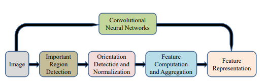
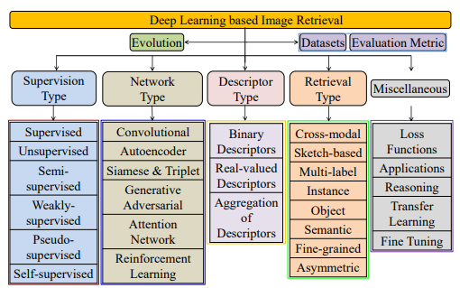

**Tóm tắt**—Mục tiêu của truy xuất hình ảnh dựa trên nội dung (CBIR) là tìm ra các hình ảnh tương tự từ một tập dữ liệu lớn so với một hình ảnh truy vấn. Nói chung, độ tương tự giữa các đặc trưng đại diện của hình ảnh truy vấn và các hình ảnh trong tập dữ liệu được sử dụng để xếp hạng các hình ảnh để truy xuất. Vào những ngày đầu, các bộ mô tả đặc trưng được thiết kế thủ công khác nhau đã được nghiên cứu dựa trên các manh mối trực quan như màu sắc, kết cấu, hình dạng, v.v. để biểu diễn hình ảnh. Tuy nhiên, học sâu (deep learning) đã nổi lên như một giải pháp thay thế chi phối cho kỹ thuật đặc trưng thiết kế thủ công trong một thập kỷ qua. Nó học các đặc trưng một cách tự động từ dữ liệu. Bài báo này trình bày một khảo sát toàn diện về các phát triển dựa trên học sâu trong thập kỷ qua cho truy xuất hình ảnh dựa trên nội dung. Việc phân loại các phương pháp hiện đại hiện có từ các góc nhìn khác nhau cũng được thực hiện để hiểu rõ hơn về sự tiến bộ. Phân loại được sử dụng trong khảo sát này bao gồm các mức độ giám sát khác nhau, các mạng khác nhau, các loại bộ mô tả khác nhau và các loại truy xuất khác nhau. Một phân tích hiệu năng cũng được thực hiện bằng cách sử dụng các phương pháp hiện đại. Những hiểu biết sâu sắc cũng được trình bày vì lợi ích của các nhà nghiên cứu để quan sát tiến trình và đưa ra những lựa chọn tốt nhất. Bài khảo sát được trình bày trong bài báo này sẽ giúp ích cho tiến trình nghiên cứu tiếp theo trong lĩnh vực truy xuất hình ảnh bằng học sâu.

**Từ khóa**—Truy xuất hình ảnh dựa trên nội dung; Học sâu; Mạng CNN; Khảo sát; Học có giám sát và không giám sát.
# I. GIỚI THIỆU

Truy xuất hình ảnh là một bài toán được nghiên cứu kỹ lưỡng về việc khớp hình ảnh, trong đó các hình ảnh tương tự được truy xuất từ cơ sở dữ liệu so với một hình ảnh truy vấn cho trước [1], [2]. Về cơ bản, độ tương tự giữa hình ảnh truy vấn và các hình ảnh trong cơ sở dữ liệu được sử dụng để xếp hạng các hình ảnh trong cơ sở dữ liệu theo thứ tự độ tương tự giảm dần [3]. Do đó, hiệu suất của bất kỳ phương pháp truy xuất hình ảnh nào phụ thuộc vào việc tính toán độ tương tự giữa các hình ảnh. Một cách lý tưởng, phương pháp tính điểm tương tự giữa hai hình ảnh phải có tính phân biệt, mạnh mẽ (robust) và hiệu quả.

## A. Truy xuất ảnh dựa trên Bộ mô tả Thủ công (Hand-crafted)

Để làm cho việc truy xuất trở nên mạnh mẽ trước các thay đổi về hình học và quang học, độ tương tự giữa các hình ảnh được tính toán dựa trên nội dung của hình ảnh. Về cơ bản, nội dung của các hình ảnh (tức là hình thức trực quan) về mặt màu sắc, kết cấu, hình dạng, gradient, v.v. được biểu diễn dưới dạng một bộ mô tả đặc trưng (feature descriptor) [4]. Độ tương tự giữa các vector đặc trưng của các hình ảnh tương ứng được coi là độ tương tự giữa các hình ảnh. Do đó, hiệu suất của bất kỳ phương pháp truy xuất hình ảnh dựa trên nội dung (CBIR) nào đều phụ thuộc rất lớn vào cách biểu diễn bộ mô tả đặc trưng của hình ảnh. Bất kỳ phương pháp biểu diễn bộ mô tả đặc trưng nào cũng được kỳ vọng có khả năng phân biệt, tính mạnh mẽ và số chiều thấp (low dimensionality).

Fig. 1: Pipeline biểu diễn đặc trưng hiện đại được thay thế bằng biểu diễn đặc trưng dựa trên CNN

Các phương pháp biểu diễn bộ mô tả đặc trưng khác nhau đã được nghiên cứu để tính toán độ tương tự giữa hai hình ảnh cho truy xuất hình ảnh dựa trên nội dung. Việc biểu diễn bộ mô tả đặc trưng sử dụng các manh mối trực quan của các hình ảnh được lựa chọn thủ công dựa trên nhu cầu [5]–[16]. Các phương pháp tiếp cận này còn được gọi là mô tả đặc trưng được thiết kế thủ công (hand-designed hoặc hand-engineered). Hơn nữa, thông thường các phương pháp này là không giám sát (unsupervised) vì chúng không cần dữ liệu để thiết kế phương pháp biểu diễn đặc trưng. Nhiều khảo sát cũng đã được thực hiện theo thời gian để trình bày tiến bộ trong truy xuất hình ảnh dựa trên nội dung, bao gồm [17] năm 2008, [18] năm 2014 và [19] năm 2017. Việc kỹ thuật đặc trưng thủ công cho truy xuất hình ảnh đã từng là một lĩnh vực nghiên cứu rất tích cực. Tuy nhiên, hiệu suất của nó bị hạn chế do các đặc trưng thủ công không thể biểu diễn một cách chính xác các đặc tính của hình ảnh.

## B. Truy xuất ảnh dựa trên Học Khoảng cách (Metric Learning)

Học khoảng cách (Distance metric learning) cũng đã được sử dụng rất rộng rãi để biểu diễn vector đặc trưng [20]. Nó cũng được khám phá kỹ lưỡng cho truy xuất hình ảnh [21]. Một số phương pháp truy xuất hình ảnh hiện đại đáng chú ý dựa trên học khoảng cách sâu bao gồm: Học khoảng cách với ràng buộc ngữ cảnh (Contextual constraints) [22], Học khoảng cách dựa trên kernel (Kernel-based) [23], [24], Học khoảng cách bảo toàn tính trực quan (Visuality-preserving) [25], Học khoảng cách dựa trên thứ hạng (Rank-based) [26], [30], [31], Học khoảng cách bán giám sát (Semi-supervised) [27], Học khoảng cách Hamming (Hamming distance) [28], [29]. Nhìn chung, các phương pháp dựa trên học khoảng cách sâu đã cho thấy hiệu suất truy xuất đầy hứa hẹn so với các phương pháp thủ công. Tuy nhiên, hầu hết các phương pháp hiện có dựa trên học khoảng cách sâu dựa vào các hàm khoảng cách tuyến tính, điều này làm hạn chế khả năng phân biệt và tính mạnh mẽ của nó trong việc biểu diễn dữ liệu phi tuyến tính cho truy xuất hình ảnh. Hơn nữa, nó cũng không thể xử lý hiệu quả việc truy xuất đa phương thức (multi-modal retrieval).

Fig. 2: Phân loại được sử dụng trong khảo sát này để phân loại các phương pháp tiếp cận truy xuất ảnh dựa trên học sâu hiện có

*Hình 2: Phân loại (Taxonomy) được sử dụng trong bài khảo sát này để phân loại các phương pháp tiếp cận truy xuất ảnh dựa trên học sâu hiện có.*

## C. Truy xuất Ảnh dựa trên Học sâu

Trong một thập kỷ qua, một sự chuyển dịch đã được quan sát thấy trong cách biểu diễn đặc trưng, từ thiết kế thủ công sang phương pháp học, sau sự nổi lên của học sâu [32], [33]. Sự chuyển đổi này được mô tả trong Hình 1, nơi việc học đặc trưng dựa trên mạng neural tích chập (CNN) thay thế quy trình tiên tiến (pipeline) truyền thống của phương pháp biểu diễn đặc trưng được thiết kế thủ công. Học sâu là một kỹ thuật biểu diễn đặc trưng phân cấp để học các đặc trưng trừu tượng từ dữ liệu, những đặc trưng quan trọng cho tập dữ liệu và ứng dụng cụ thể đó [34].

Dựa trên loại dữ liệu cần xử lý, các kiến trúc khác nhau đã ra đời như:
*   **Mạng Neural Nhân tạo (ANN)/ Perceptron Đa tầng (MLP):** cho dữ liệu 1 chiều (1-D) [35], [36].
*   **Mạng Neural Tích chập (CNN):** cho dữ liệu hình ảnh [37], [38].
*   **Mạng Neural Đệ quy (RNN):** cho dữ liệu chuỗi thời gian [39], [40].

Một tiến bộ to lớn đã được thực hiện trong thập kỷ này để tận dụng sức mạnh của học sâu cho truy xuất hình ảnh dựa trên nội dung [32], [41], [42], [43], [44]. Do đó, bài khảo sát này chủ yếu tập trung vào sự tiến bộ trong các mô hình và đặc trưng dựa trên học sâu tiên tiến cho truy xuất hình ảnh dựa trên nội dung từ khi nó ra đời. Một hệ thống phân loại cho cùng mục đích được minh họa trong Hình 2.

Những đóng góp chính của bài khảo sát này có thể được phác thảo như sau:

1.  **Bao quát toàn diện:** Bài khảo sát này bao phủ các phương pháp tiếp cận truy xuất ảnh dựa trên học sâu một cách rất toàn diện về mặt: sự phát triển của truy xuất ảnh sử dụng học sâu, các loại hình giám sát khác nhau, loại mạng, loại bộ mô tả, loại truy xuất và các khía cạnh khác.
2.  **Phạm vi thời gian cụ thể và Phân loại rộng:** Khác với các bài tổng quan gần đây [42], [21], [43], bài khảo sát này tập trung cụ thể vào tiến trình trong giai đoạn thập kỷ 2011-2020. Một hệ thống phân loại mang tính thông tin được cung cấp với phạm vi bao phủ rộng các phương pháp tiếp cận truy xuất ảnh dựa trên học sâu hiện có so với bài khảo sát gần đây [44].
3.  **Phân tích đa chiều:** Bài khảo sát này trang bị cho người đọc kiến thức về truy xuất ảnh tiên tiến sử dụng các phương pháp học sâu cùng với việc phân tích từ nhiều góc nhìn khác nhau.
4.  **So sánh và thảo luận:** Bài báo này cũng trình bày những điểm nổi bật tóm tắt và các thảo luận quan trọng, cùng với các so sánh toàn diện trên các tập dữ liệu chuẩn (benchmark) sử dụng các phương pháp tiếp cận truy xuất ảnh dựa trên học sâu tiên tiến.
**Bài khảo sát này được tổ chức như sau:**
*   **Phần II** trình bày **bối cảnh/kiến thức nền tảng**.
*   **Phần III** tổng hợp **sự phát triển (evolution)** của truy xuất ảnh dựa trên học sâu.
*   Việc **phân loại** các phương pháp tiếp cận hiện có được thảo luận chi tiết trong các phần tiếp theo:
    *   **Phần IV:** Phân loại dựa trên **loại hình giám sát** (supervision type).
    *   **Phần V:** Phân loại dựa trên **loại mạng** (network type).
    *   **Phần VI:** Phân loại dựa trên **loại bộ mô tả** (descriptor type).
    *   **Phần VII:** Phân loại dựa trên **loại truy xuất** (retrieval type).
*   **Phần VIII** nêu bật **một số khía cạnh khác**.
*   **Phần IX** thực hiện **so sánh hiệu năng** giữa các phương pháp phổ biến.
*   **Phần X** trình bày **kết luận và các hướng nghiên cứu tương lai**.