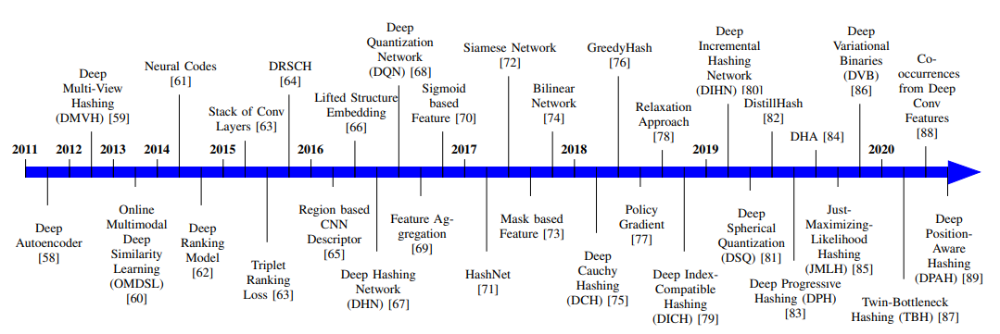
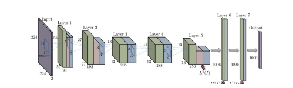

# II. KIẾN THỨC NỀN TẢNG

Phần này trình bày kiến thức nền tảng về các chỉ số đánh giá thường được sử dụng và các tập dữ liệu chuẩn (benchmark datasets).

## A. Các Phép đo Đánh giá Truy xuất

Để đánh giá hiệu năng của các phương pháp truy xuất ảnh, **độ chính xác (precision)**, **độ bao phủ (recall)** và **f-score** là các chỉ số đánh giá phổ biến. **Độ chính xác trung bình (mean Average Precision - mAP)** là một chỉ số được sử dụng rất thường xuyên trong các tài liệu nghiên cứu.

*   **Độ chính xác (Precision)** được định nghĩa là tỷ lệ phần trăm của các ảnh được truy xuất đúng trên tổng số ảnh được truy xuất.
*   **Độ bao phủ (Recall)** là một thước đo hiệu năng khác được sử dụng cho truy xuất ảnh, được tính bằng tỷ lệ phần trăm của các ảnh được truy xuất đúng trên tổng số ảnh thực sự liên quan có trong tập dữ liệu.
*   **F-score** được tính từ trung bình điều hòa (harmonic mean) của độ chính xác và độ bao phủ.

## B. Các Tập Dữ liệu

Với sự ra đời của các mô hình học sâu, nhiều tập dữ liệu quy mô lớn đã được tạo ra để tạo điều kiện cho nghiên cứu trong lĩnh vực nhận dạng và truy xuất ảnh. Chi tiết về các tập dữ liệu lớn được tóm tắt trong Bảng I.

Các tập dữ liệu chứa nhiều loại hình ảnh khác nhau có sẵn để kiểm tra các phương pháp tiếp cận dựa trên học sâu, chẳng hạn như:
*   **Tập dữ liệu danh mục đối tượng (Object category):** [45], [52], [53]
*   **Tập dữ liệu cảnh (Scene):** [46], [49], [90]
*   **Tập dữ liệu chữ số (Digit):** [47], [48]
*   **Tập dữ liệu trang phục (Apparel):** [50], [51]
*   **Tập dữ liệu địa danh (Landmark):** [55], [56], v.v.

Fig. 3: A chronological view of deep learning based image retrieval methods depicting its evolution from 2011 to 2020.

*   Tập dữ liệu **CIFAR-10** là một tập dữ liệu danh mục đối tượng được sử dụng rất rộng rãi [45].
*   **ImageNet (ILSVRC2012)**, một tập dữ liệu quy mô lớn, cũng là một tập dữ liệu danh mục đối tượng với hơn một triệu hình ảnh [52].
*   Tập dữ liệu **MS COCO** [53] được tạo ra cho bài toán phát hiện đối tượng thông thường cũng được sử dụng cho mục đích truy xuất ảnh.
*   Trong số các tập dữ liệu ảnh cảnh thường được sử dụng cho mục đích truy xuất:
    *   Tập dữ liệu **NUS-WIDE** đến từ Đại học Quốc gia Singapore [46].
    *   **Sun397** là một tập dữ liệu để hiểu cảnh quan với 397 danh mục và hơn một lakh (100,000) hình ảnh [49], [91].
    *   Tập dữ liệu **MIRFlicker-1M** [90] bao gồm một triệu hình ảnh được tải xuống từ trang web chia sẻ ảnh Flickr.
*   Tập dữ liệu **MNIST** là một trong những tập dữ liệu ảnh chữ số quy mô lớn lâu đời [47], bao gồm các ký tự quang học.
*   **SVHN** là một tập dữ liệu chữ số khác [48] từ các hình ảnh số nhà chụp từ street view, phức tạp hơn so với tập dữ liệu MNIST.
*   Tập dữ liệu trang phục giày, **UT-ZAP50K** [50], bao gồm khoảng 50K hình ảnh.
*   **Yahoo-1M** là một tập dữ liệu lớn khác về trang phục được sử dụng trong [51] để truy xuất ảnh.
*   Tập dữ liệu **Google Landmarks** có khoảng một triệu hình ảnh địa danh [55].
*   Phiên bản mở rộng của Google Landmarks (v2) [56] chứa khoảng 5 triệu hình ảnh địa danh.

Vẫn còn nhiều tập dữ liệu khác được sử dụng để truy xuất trong các tài liệu nghiên cứu, chẳng hạn như Corel, Oxford, Paris, v.v., tuy nhiên, đây không phải là những tập dữ liệu quy mô lớn. **CIFAR-10, MNIST, SVHN và ImageNet** là những tập dữ liệu được sử dụng rộng rãi trong phần lớn các nghiên cứu.

**Clickture** là một tập dữ liệu phổ biến cho nhật ký tìm kiếm dựa trên các truy vấn của người dùng [57]. Thuộc tính click (lượng nhấp chuột) đã được tận dụng cho các ứng dụng khác nhau, chẳng hạn như học chéo chế độ xem (cross-view learning) để tìm kiếm hình ảnh [92], học khoảng cách (distance metric learning) để xếp hạng hình ảnh [93] và các phép nhúng bảo toàn cấu trúc sâu (deep structure-preserving embeddings) với cơ chế chú ý trực quan (visual attention) [94].

**Lưu ý:** Chỉ các tập dữ liệu CIFAR-10 và MNIST chứa số lượng mẫu giống nhau trong mỗi danh mục. Các tập dữ liệu khác thường được tạo ra trong môi trường không ràng buộc với số lượng mẫu khổng lồ, do đó các lớp không được cân bằng. Việc lựa chọn tập dữ liệu có thể phụ thuộc vào kịch bản nơi cần sử dụng các mô hình truy xuất ảnh, chẳng hạn như tập dữ liệu danh mục đối tượng và cảnh quan cho môi trường không ràng buộc, tập dữ liệu trang phục cho các ứng dụng thương mại điện tử và tập dữ liệu địa danh cho các ứng dụng lái xe.

# III. SỰ PHÁT TRIỂN CỦA HỌC SÂU CHO TRUY XUẤT ẢNH DỰA TRÊN NỘI DUNG (CBIR)

Việc tạo ra các bộ mô tả (descriptors) hoặc mã băm (hash codes) dựa trên học sâu là xu hướng gần đây cho truy xuất ảnh dựa trên nội dung quy mô lớn, nhờ vào hiệu quả tính toán và chất lượng truy xuất của nó [21]. Trong phần này, hành trình của các mô hình học sâu cho truy xuất ảnh từ năm 2011 đến 2020 được trình bày dưới dạng tổng quan theo trình tự thời gian trong Hình 3.

Hình 4: Minh họa về việc tạo mã thần kinh từ một mạng nơ-ron tích chập (CNN) [61].

1.  **2011-2013:** Trong số những nỗ lực ban đầu, vào năm 2011, Krizhevsky và Hinton đã sử dụng một **mã tự động sâu (deep autoencoder)** để ánh xạ các hình ảnh thành các mã nhị phân ngắn cho truy xuất ảnh dựa trên nội dung (CBIR) [58]. Kang et al. (2012) đã đề xuất **phép băm đa chế độ xem sâu (deep multi-view hashing)** để tạo mã cho CBIR từ nhiều chế độ xem dữ liệu bằng cách mô hình hóa các lớp với các nút ẩn dành riêng cho chế độ xem và các nút ẩn được chia sẻ [59]. Năm 2013, Wu et al. đã xem xét **nhiều mã tự động khử nhiễu xếp chồng (stacked denoising autoencoders)** được tiền huấn luyện trên các đặc trưng cấp thấp của hình ảnh [60]. Họ cũng tinh chỉnh (fine-tune) nhiều mạng sâu trên đầu ra của các mã tự động đã được tiền huấn luyện.

2.  **2014:** Trong một công trình xuất sắc, các **kích hoạt (activations)** của các lớp trên cùng của một mạng neural tích chập (CNN) lớn được sử dụng làm **bộ mô tả (mã neural - neural codes)** cho truy xuất ảnh [61] như được mô tả trong Hình 4. Một hiệu năng rất hứa hẹn đã được ghi nhận khi sử dụng mã neural cho truy xuất ảnh, ngay cả khi mô hình được huấn luyện trên dữ liệu không liên quan. Mã neural được nén bằng **phân tích thành phần chính (Principal Component Analysis - PCA)** để tạo ra bộ mô tả nhỏ gọn. Cùng năm 2014, mô hình **xếp hạng sâu (deep ranking)** được nghiên cứu bằng cách học trực tiếp phép đo độ tương tự từ các hình ảnh [62]. Về cơ bản, các **bộ ba (triplets)** được sử dụng để nắm bắt sự khác biệt giữa các lớp (inter-class) và trong nội bộ lớp (intra-class) của hình ảnh.