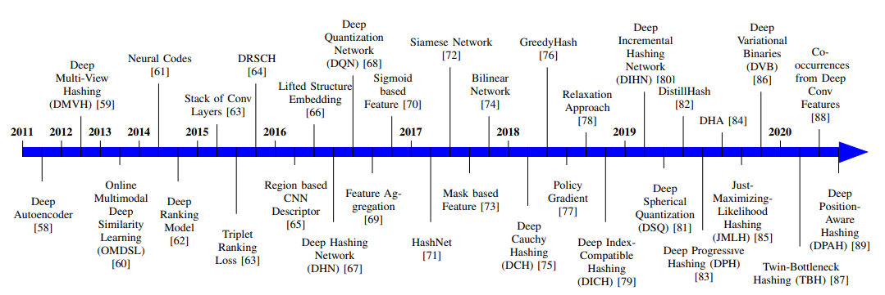

# II. KIẾN THỨC NỀN TẢNG

Phần này trình bày kiến thức nền tảng về các chỉ số đánh giá thường được sử dụng và các tập dữ liệu chuẩn (benchmark datasets).

## A. Các Phép đo Đánh giá Truy xuất

Để đánh giá hiệu năng của các phương pháp truy xuất ảnh, **độ chính xác (precision)**, **độ bao phủ (recall)** và **f-score** là các chỉ số đánh giá phổ biến. **Độ chính xác trung bình (mean Average Precision - mAP)** là một chỉ số được sử dụng rất thường xuyên trong các tài liệu nghiên cứu.

*   **Độ chính xác (Precision)** được định nghĩa là tỷ lệ phần trăm của các ảnh được truy xuất đúng trên tổng số ảnh được truy xuất.
*   **Độ bao phủ (Recall)** là một thước đo hiệu năng khác được sử dụng cho truy xuất ảnh, được tính bằng tỷ lệ phần trăm của các ảnh được truy xuất đúng trên tổng số ảnh thực sự liên quan có trong tập dữ liệu.
*   **F-score** được tính từ trung bình điều hòa (harmonic mean) của độ chính xác và độ bao phủ.

## B. Các Tập Dữ liệu

Với sự ra đời của các mô hình học sâu, nhiều tập dữ liệu quy mô lớn đã được tạo ra để tạo điều kiện cho nghiên cứu trong lĩnh vực nhận dạng và truy xuất ảnh. Chi tiết về các tập dữ liệu lớn được tóm tắt trong Bảng I.

Các tập dữ liệu chứa nhiều loại hình ảnh khác nhau có sẵn để kiểm tra các phương pháp tiếp cận dựa trên học sâu, chẳng hạn như:
*   **Tập dữ liệu danh mục đối tượng (Object category):** [45], [52], [53]
*   **Tập dữ liệu cảnh (Scene):** [46], [49], [90]
*   **Tập dữ liệu chữ số (Digit):** [47], [48]
*   **Tập dữ liệu trang phục (Apparel):** [50], [51]
*   **Tập dữ liệu địa danh (Landmark):** [55], [56], v.v.

Fig. 3: A chronological view of deep learning based image retrieval methods depicting its evolution from 2011 to 2020.

*   Tập dữ liệu **CIFAR-10** là một tập dữ liệu danh mục đối tượng được sử dụng rất rộng rãi [45].
*   **ImageNet (ILSVRC2012)**, một tập dữ liệu quy mô lớn, cũng là một tập dữ liệu danh mục đối tượng với hơn một triệu hình ảnh [52].
*   Tập dữ liệu **MS COCO** [53] được tạo ra cho bài toán phát hiện đối tượng thông thường cũng được sử dụng cho mục đích truy xuất ảnh.
*   Trong số các tập dữ liệu ảnh cảnh thường được sử dụng cho mục đích truy xuất:
    *   Tập dữ liệu **NUS-WIDE** đến từ Đại học Quốc gia Singapore [46].
    *   **Sun397** là một tập dữ liệu để hiểu cảnh quan với 397 danh mục và hơn một lakh (100,000) hình ảnh [49], [91].
    *   Tập dữ liệu **MIRFlicker-1M** [90] bao gồm một triệu hình ảnh được tải xuống từ trang web chia sẻ ảnh Flickr.
*   Tập dữ liệu **MNIST** là một trong những tập dữ liệu ảnh chữ số quy mô lớn lâu đời [47], bao gồm các ký tự quang học.
*   **SVHN** là một tập dữ liệu chữ số khác [48] từ các hình ảnh số nhà chụp từ street view, phức tạp hơn so với tập dữ liệu MNIST.
*   Tập dữ liệu trang phục giày, **UT-ZAP50K** [50], bao gồm khoảng 50K hình ảnh.
*   **Yahoo-1M** là một tập dữ liệu lớn khác về trang phục được sử dụng trong [51] để truy xuất ảnh.
*   Tập dữ liệu **Google Landmarks** có khoảng một triệu hình ảnh địa danh [55].
*   Phiên bản mở rộng của Google Landmarks (v2) [56] chứa khoảng 5 triệu hình ảnh địa danh.

Vẫn còn nhiều tập dữ liệu khác được sử dụng để truy xuất trong các tài liệu nghiên cứu, chẳng hạn như Corel, Oxford, Paris, v.v., tuy nhiên, đây không phải là những tập dữ liệu quy mô lớn. **CIFAR-10, MNIST, SVHN và ImageNet** là những tập dữ liệu được sử dụng rộng rãi trong phần lớn các nghiên cứu.

**Clickture** là một tập dữ liệu phổ biến cho nhật ký tìm kiếm dựa trên các truy vấn của người dùng [57]. Thuộc tính click (lượng nhấp chuột) đã được tận dụng cho các ứng dụng khác nhau, chẳng hạn như học chéo chế độ xem (cross-view learning) để tìm kiếm hình ảnh [92], học khoảng cách (distance metric learning) để xếp hạng hình ảnh [93] và các phép nhúng bảo toàn cấu trúc sâu (deep structure-preserving embeddings) với cơ chế chú ý trực quan (visual attention) [94].

**Lưu ý:** Chỉ các tập dữ liệu CIFAR-10 và MNIST chứa số lượng mẫu giống nhau trong mỗi danh mục. Các tập dữ liệu khác thường được tạo ra trong môi trường không ràng buộc với số lượng mẫu khổng lồ, do đó các lớp không được cân bằng. Việc lựa chọn tập dữ liệu có thể phụ thuộc vào kịch bản nơi cần sử dụng các mô hình truy xuất ảnh, chẳng hạn như tập dữ liệu danh mục đối tượng và cảnh quan cho môi trường không ràng buộc, tập dữ liệu trang phục cho các ứng dụng thương mại điện tử và tập dữ liệu địa danh cho các ứng dụng lái xe.

# III. SỰ PHÁT TRIỂN CỦA HỌC SÂU CHO TRUY XUẤT ẢNH DỰA TRÊN NỘI DUNG (CBIR)

Việc tạo ra các bộ mô tả (descriptors) hoặc mã băm (hash codes) dựa trên học sâu là xu hướng gần đây cho truy xuất ảnh dựa trên nội dung quy mô lớn, nhờ vào hiệu quả tính toán và chất lượng truy xuất của nó [21]. Trong phần này, hành trình của các mô hình học sâu cho truy xuất ảnh từ năm 2011 đến 2020 được trình bày dưới dạng tổng quan theo trình tự thời gian trong Hình 3.

Hình 4: Minh họa về việc tạo mã thần kinh từ một mạng nơ-ron tích chập (CNN) [61].

1.  **2011-2013:** Trong số những nỗ lực ban đầu, vào năm 2011, Krizhevsky và Hinton đã sử dụng một **mã tự động sâu (deep autoencoder)** để ánh xạ các hình ảnh thành các mã nhị phân ngắn cho truy xuất ảnh dựa trên nội dung (CBIR) [58]. Kang et al. (2012) đã đề xuất **phép băm đa chế độ xem sâu (deep multi-view hashing)** để tạo mã cho CBIR từ nhiều chế độ xem dữ liệu bằng cách mô hình hóa các lớp với các nút ẩn dành riêng cho chế độ xem và các nút ẩn được chia sẻ [59]. Năm 2013, Wu et al. đã xem xét **nhiều mã tự động khử nhiễu xếp chồng (stacked denoising autoencoders)** được tiền huấn luyện trên các đặc trưng cấp thấp của hình ảnh [60]. Họ cũng tinh chỉnh (fine-tune) nhiều mạng sâu trên đầu ra của các mã tự động đã được tiền huấn luyện.

2.  **2014:** Trong một công trình xuất sắc, các **kích hoạt (activations)** của các lớp trên cùng của một mạng neural tích chập (CNN) lớn được sử dụng làm **bộ mô tả (mã neural - neural codes)** cho truy xuất ảnh [61] như được mô tả trong Hình 4. Một hiệu năng rất hứa hẹn đã được ghi nhận khi sử dụng mã neural cho truy xuất ảnh, ngay cả khi mô hình được huấn luyện trên dữ liệu không liên quan. Mã neural được nén bằng **phân tích thành phần chính (Principal Component Analysis - PCA)** để tạo ra bộ mô tả nhỏ gọn. Cùng năm 2014, mô hình **xếp hạng sâu (deep ranking)** được nghiên cứu bằng cách học trực tiếp phép đo độ tương tự từ các hình ảnh [62]. Về cơ bản, các **bộ ba (triplets)** được sử dụng để nắm bắt sự khác biệt giữa các lớp (inter-class) và trong nội bộ lớp (intra-class) của hình ảnh.
3.  **2015:** Năm 2015, một kiến trúc sâu được phát triển bao gồm một chồng các lớp tích chập để tạo ra các đặc trưng ảnh trung gian [63], sau đó được sử dụng để tạo ra các bit băm. **Hàm mất mát xếp hạng bộ ba (triplet ranking loss)** cũng được sử dụng để kết hợp các khác biệt giữa các lớp và trong nội bộ lớp trong [63] cho truy xuất ảnh. Zhang et al. (2015) đã phát triển **phép băm so sánh tương tự có quy chuẩn sâu (deep regularized similarity comparison hashing - DRSCH)** bằng cách huấn luyện một mô hình CNN sâu để đồng thời tối ưu hóa các đặc trưng ảnh phân biệt và các hàm băm [64].

4.  **2016:** Năm 2016, Gordo et al. đã **gộp (pooled)** các vùng liên quan để tạo thành bộ mô tả với sự trợ giúp của một mạng đề xuất vùng (region proposal network) để ưu tiên các vùng đối tượng quan trọng [65]. Song et al. (2016) đã tính toán **lifted structure loss** giữa các đặc trưng CNN và các đặc trưng gốc [66]. **Mạng băm sâu có giám sát (Supervised deep hashing network - DHN)** học biểu diễn ảnh quan trọng bằng cách kiểm soát lỗi lượng tử hóa (quantization error) [67]. Cùng thời điểm, Cao et al. đã giới thiệu **mạng lượng tử hóa sâu (deep quantization network - DQN)** [68], rất giống với mô hình DHN. Các đặc trưng dựa trên CNN được **tổng hợp (aggregated)** trong [69] với sự trợ giúp của phép gán đa nhiệm nhận biết thứ hạng (rank-aware multi-assignment) và kết hợp dựa trên hướng (direction based combination). Một **lớp sigmoid** được thêm vào trước lớp mất mát của một CNN để học mã nhị phân cho CBIR [70].

5.  **2017:** Năm 2017, Cao et al. đã đề xuất kiến trúc sâu **HashNet** để tạo mã băm bằng một **phương pháp tiếp nối (continuation method)** [71]. Nó học các kích hoạt nhị phân không trơn (non-smooth binary activations) bằng phương pháp tiếp nối để tạo ra các mã băm nhị phân từ dữ liệu tương tự không cân bằng (imbalanced similarity data). Gordo et al. (2017) đã chỉ ra rằng dữ liệu huấn luyện nhiễu, kiến trúc sâu không phù hợp và quy trình huấn luyện chưa tối ưu là những rào cản chính để tận dụng học sâu cho truy xuất ảnh [72]. Các **sơ đồ che (masking schemes)** khác nhau được sử dụng trong [73] để lựa chọn các đặc trưng CNN nổi bật cho truy xuất ảnh. Một **mạng song tuyến (bilinear network)** với hai CNN song song cũng được sử dụng làm bộ trích xuất đặc trưng [74].

6.  **2018:** Năm 2018, Cao et al. đã nghiên cứu một mô hình **băm Cauchy sâu (deep cauchy hashing - DCH)** cho mã băm nhị phân với sự trợ giúp của một hàm mất mát entropy chéo theo cặp (pairwise cross-entropy loss) dựa trên phân phối Cauchy [75]. Su et al. đã sử dụng **greedy hash** bằng cách truyền gradient nguyên vẹn trong quá trình lan truyền ngược (backpropagation) cho lớp mã hóa băm sử dụng hàm sign trong lan truyền thuận (forward propagation) [76]. Các phương pháp tiếp cận khác như **policy gradient** [77] và **khai triển chuỗi (series expansion)** [78] cũng được sử dụng để huấn luyện các mô hình. Phương pháp **băm tương thích chỉ mục sâu (deep index-compatible hashing - DICH)** [79] được nghiên cứu bằng cách giảm thiểu số bit tương tự giữa các mã nhị phân của các ảnh thuộc các lớp khác nhau.

7.  **2019:** Năm 2019, một **mạng băm gia tăng sâu (deep incremental hashing network - DIHN)** được đề xuất trong [80] để trực tiếp học các mã băm tương ứng với các ảnh thuộc lớp mới, đồng thời vẫn giữ lại các mã băm của các ảnh thuộc lớp hiện có. Một biểu diễn điểm dựa trên **lượng tử hóa có giám sát trên một siêu cầu đơn vị (unit hypersphere)** được sử dụng trong mô hình **lượng tử hóa cầu sâu (deep spherical quantization - DSQ)** [81]. **DistillHash** [82] chưng cất (distill) các cặp dữ liệu và học các hàm băm sâu từ tập dữ liệu đã được chưng cất bằng cách sử dụng framework học Bayes. Một mô hình **băm tiến triển sâu (deep progressive hashing - DPH)** được phát triển để tạo ra một chuỗi mã nhị phân bằng cách sử dụng các vùng nổi bật (salient regions) được mở rộng dần [83]. **Băm sâu dựa trên hàm mất mát thích ứng (Adaptive loss)** [84], **băm chỉ tối đa hóa hợp lý (just-maximizing-likelihood hashing - JMLH)** [85] và **binaries biến phân sâu (deep variational binaries - DVB)** [86] là các phương pháp khác được khám phá vào năm 2019.

8.  **2020:** Gần đây, vào năm 2020, Shen et al. đã đưa ra một mô hình **băm thắt cổ chai đôi (twin-bottleneck hashing - TBH)** giữa mạng mã hóa (encoder) và giải mã (decoder) [87]. Họ đã sử dụng các nút thắt cổ chai (bottlenecks) nhị phân và liên tục như các biến tiềm ẩn (latent variables) một cách hợp tác (collaborative manner). Forcen et al. (2020) đã sử dụng lớp tích chập cuối cùng của biểu diễn CNN bằng cách mô hình hóa các **đồng xuất hiện (co-occurrences)** từ các đặc trưng tích chập sâu [88]. Một mô hình **băm nhận biết vị trí sâu (deep position-aware hashing - DPAH)** được đề xuất vào năm 2020 [89], mô hình này ràng buộc khoảng cách giữa các mẫu dữ liệu và các trung tâm lớp.

**Tóm tắt và Phân tích:**
Phần lớn các phương pháp được phát triển giữa năm 2011 và 2015 sử dụng các đặc trưng được học bởi các mã tự động (autoencoders) và mạng neural tích chập. Tuy nhiên, các phương pháp này gặp phải vấn đề về **khả năng phân biệt kém** hơn do các mô hình thường được huấn luyện cho bài toán phân loại và **mất mát thông tin** do quá trình lượng tử hóa đặc trưng.

Truy xuất ảnh sử dụng học sâu đã chứng kiến sự tăng trưởng mạnh mẽ trong giai đoạn **từ 2016 đến 2020**. Vì ứng dụng truy xuất ảnh cần học đặc trưng để so khớp, nhiều loại mạng khác nhau đã được sử dụng cho mục đích này. Các phương pháp gần đây đã thiết kế nhiều **hàm mục tiêu (objective functions)** dẫn đến việc **tách biệt giữa các lớp cao** và **sự kết tụ trong nội bộ lớp cao** trong không gian đặc trưng. Hơn nữa, sự phát triển trong các kiến trúc mạng khác nhau cũng dẫn đến sự tăng trưởng trong lĩnh vực truy xuất ảnh. Vấn đề then chốt mà các phương pháp học sâu đang giải quyết là học các đặc trưng **rất phân biệt, mạnh mẽ và nhỏ gọn** cho truy xuất ảnh.