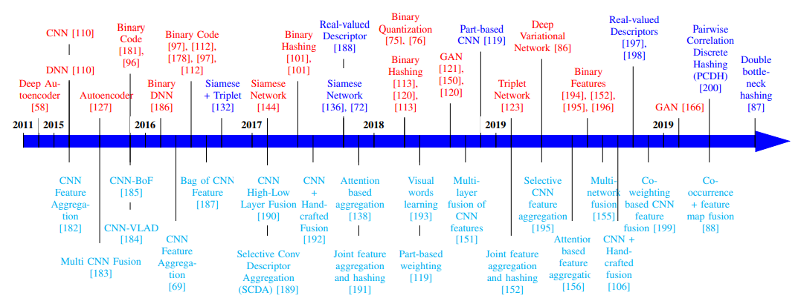

# VI. LOẠI BỘ MÔ TẢ CHO TRUY XUẤT ẢNH

Phần này bao gồm các **mã băm nhị phân (binary hash codes)** cho truy xuất ảnh hiệu quả, các **bộ mô tả giá trị thực (real-valued descriptors)** và **tổng hợp đặc trưng (feature aggregation)** cho truy xuất ảnh có tính phân biệt, như được mô tả trong Hình 8.

## A. Bộ mô tả Nhị phân (Binary Descriptors)

Nhiều loại mạng khác nhau được sử dụng để học **mô tả nhị phân**, chẳng hạn như:
*   Mạng neural sâu (deep neural networks) [110]
*   Mạng neural tích chập (convolutional neural networks) [51]
*   Mạng mã tự động (autoencoder networks) [127]
*   Mạng Siamese (siamese networks) [144]
*   Mạng Triplet (triplet networks) [123]
*   Mạng đối sinh (generative adversarial networks) [166]
*   Và mạng biến phân (variational networks) [86]

*   Năm 2015, Liong et al. [110] đã giới thiệu **phép băm sâu có giám sát (supervised deep hashing - SDH)**. Phương pháp SDH sử dụng các ràng buộc **mất mát lượng tử hóa (quantization loss)**, **bit cân bằng (balanced bits)** và **bit độc lập (independent bits)**.
*   Mã băm nhị phân cũng được học thông qua một **lớp tiềm ẩn (latent layer)** một cách có giám sát trong [51].
*   Một **mã tự động nhị phân (binary autoencoder)** [58], [127] và một **mạng Siamese** [144] được sử dụng để học các đặc trưng nhị phân cho truy xuất ảnh hiệu quả.
*   Một **mạng neural sâu nhị phân (binary deep neural network - BDNN)** được đề xuất bằng cách chuyển đổi đầu ra của một lớp ẩn thành mã nhị phân [186], [194].
*   Mã nhị phân được học **đồng thời (jointly)** với việc tổng hợp đặc trưng trong [152].
*   Một **kỹ thuật che (masking technique)** trên các đặc trưng tích chập được sử dụng để tạo ra mô tả nhị phân cho truy xuất ảnh [195].
*   Một phương pháp **băm rời rạc tối ưu hóa thứ hạng (ranking optimization discrete hashing - RODH)** được sử dụng trong [196] bằng cách tạo ra các mã băm rời rạc (+1 hoặc -1) bằng cách sử dụng thông tin xếp hạng.
*   Một **mất mát lượng tử hóa Cauchy (cauchy quantization loss)** được sử dụng trong [75] để cải thiện **khả năng phân biệt (discriminative power)** của các bộ mô tả nhị phân.
*   Một phương pháp **lượng tử hóa lặp (iterative quantization)** được sử dụng để chuyển đổi các đặc trưng thành mã nhị phân nhằm tránh mất mát lượng tử hóa [76].
*   Mã băm nhị phân cũng được sử dụng để truy xuất ảnh quần áo (clothing) [181].
*   Mô tả nhị phân được học thông qua các kỹ thuật học sâu **có giám sát** [96], [97], [101], **không giám sát** [112], [113], [120] và **tự giám sát** [178].
*   Trong số các phương pháp sinh (generative), một **mạng đối sinh nhị phân (binary generative adversarial network - BGAN)** được sử dụng để học mã nhị phân [121].
*   Cùng thời điểm, một GAN có **chính quy (regularized)** được sử dụng bằng cách **cực đại hóa entropy (maximizing the entropy)** của lớp đã được nhị phân hóa cho truy xuất ảnh [150].
*   GAN được huấn luyện ở **chế độ không giám sát** [120] để học các mã nhị phân cho truy xuất ảnh.
*   Năm 2020, **GAN nhị phân (binary GAN)** [166] được sử dụng **đồng thời (jointly)** cho truy xuất ảnh và nén ảnh.

## B. Bộ mô tả Giá trị thực (Real-Valued Descriptors)

Các phương pháp băm nhị phân có những **hạn chế (shortcomings)** rõ ràng:
1.  Thứ nhất, rất khó để biểu diễn **độ tương tự chi tiết (fine-grained similarity)** bằng mã nhị phân.
2.  Thứ hai, việc tạo ra các **mã nhị phân tương tự (similar binary codes)** là phổ biến ngay cả đối với các hình ảnh khác nhau.

Do đó, các nhà nghiên cứu cũng đã sử dụng các **đặc trưng giá trị thực (real-valued features)** để biểu diễn hình ảnh cho việc truy xuất.

*   Các **mạng Siamese** đã được sử dụng rộng rãi để học **bộ mô tả đặc trưng giá trị thực (real-valued feature descriptor)** cho truy xuất ảnh [132], [136], [72].
*   Năm 2018, các đặc trưng CNN **dựa trên bộ phận (part-based)** được sử dụng để trích xuất một **mã băm không nhị phân (non-binary hash code)** [119].
*   Các bộ mô tả giá trị thực được tạo bằng CNN được sử dụng cho:
    *   Truy xuất ảnh y tế (medical image retrieval) [188], [197]
    *   Truy xuất đa phương thức (cross-modal retrieval) [198]
*   Chen et al. (2020) [200] đã phát triển **phép băm rời rạc tương quan theo cặp (pairwise correlation discrete hashing - PCDH)** bằng cách khai thác **sự tương quan theo cặp (pairwise correlation)** của các đặc trưng sâu cho truy xuất ảnh.
*   Shen et al. (2020) [87] cũng đã sử dụng các bộ mô tả giá trị thực với sự trợ giúp của phương pháp **băm nút thắt cổ chai kép (double bottleneck hashing)** cho truy xuất ảnh.
*Hình 8: Sơ đồ trình tự thời gian của các phương pháp truy xuất ảnh dựa trên học sâu, mô tả các loại mô tả khác nhau. Các mô hình dựa trên vectơ đặc trưng nhị phân và vectơ đặc trưng giá trị thực được thể hiện lần lượt bằng màu Đỏ và Xanh lam. Các mô hình dựa trên tổng hợp đặc trưng được thể hiện bằng màu Xanh lam.
