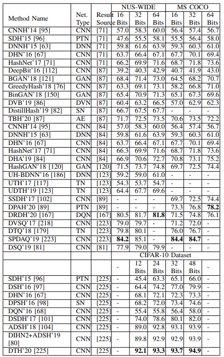
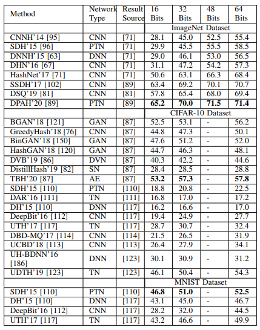

# VIII. CÁC NỘI DUNG KHÁC (MISCELLANEOUS)

Phần này bao gồm các mô hình học sâu cho truy xuất dưới góc độ của các **hàm mất mát (losses)** khác nhau, **ứng dụng (applications)** và các khía cạnh khác.

## A. Tiến bộ trong Hàm Mất mát cho Truy xuất (Progress in Retrieval Loss)

*   Một **hàm mất mát dựa trên Siamese (siamese based loss function)** được sử dụng trong [132] bởi Kumar et al. (2016) để **cực tiểu hóa mất mát toàn cục (minimizing the global loss)** dẫn đến việc học đặc trưng có tính phân biệt.
*   Zhou et al. (2017) đã sử dụng **mất mát lượng tử hóa bộ ba (triplet quantization loss)** cho băm sâu, dựa trên độ tương tự giữa các cặp **neo-tích cực (anchor-positive)** và **neo-tiêu cực (anchor-negative)** [135].
*   Một **mất mát theo danh sách (listwise loss)** đã được sử dụng bởi Revaud et al. vào năm 2019 [224] để **tối ưu hóa trực tiếp (directly optimize)** độ chính xác trung bình toàn cục (global mean average precision) trong học sâu **đầu cuối (end-to-end)**.
*   Năm 2020, một **hàm mất mát entropy chéo từng đoạn (piecewise cross entropy loss function)** được sử dụng trong [221] cho truy xuất ảnh chi tiết.
*   Nhiều hàm mất mát sáng tạo đã được sử dụng bởi các phương pháp học đặc trưng khác nhau, chẳng hạn như **mất mát cấu trúc nâng (lifted structured loss)** [66] và **mất mát xếp hạng (ranking loss)** [147].

## B. Ứng dụng (Applications)

Các phương pháp tiếp cận dựa trên học sâu đã được sử dụng cho truy xuất ảnh liên quan đến các ứng dụng khác nhau, chẳng hạn như:
*   Truy xuất quần áo (cloth retrieval) [181]
*   Truy xuất ảnh y sinh (biomedical image retrieval) [197]
*   Truy xuất khuôn mặt (face retrieval) [226], [227]
*   Truy xuất ảnh viễn thám (remote sensing image retrieval) [124]
*   Truy xuất địa danh (landmark retrieval) [228]
*   Truy xuất ảnh mạng xã hội (social image retrieval) [229]
*   Và truy xuất video (video retrieval) [178]
---

**BẢNG II:** Độ chính xác trung bình (Mean Average Precision - mAP) với 5000 ảnh được truy xuất (mAP@5000) tính bằng % cho các phương pháp tiếp cận truy xuất ảnh dựa trên học sâu khác nhau trên các tập dữ liệu NUS-WIDE, MS COCO và CIFAR-10. Lưu ý rằng cột thứ 2 liệt kê tài liệu tham khảo nơi kết quả của phương pháp tương ứng được xem xét. Sau đây là các từ viết tắt được sử dụng cho các loại mạng khác nhau trong kết quả: DNN - Mạng Neural Sâu, CNN - Mạng Neural Tích chập, SN - Mạng Siamese, TN - Mạng Triplet, GAN - Mạng Đối sinh, DQN - Mạng Q Sâu, PTN - Mạng Biến đổi Tham số, DVN - Mạng Biến phân Sâu và AE - Mã tự động.

## C. Các Khía cạnh Khác (Others)

*   **Độ khó của băm (Hashing difficulty)** cũng được tăng lên bằng cách tạo ra các **mẫu khó hơn (harder samples)** theo cách **tự điều chỉnh (self-paced manner)** [161] để làm cho việc huấn luyện mạng trở nên **định hướng suy luận (reasoning oriented)**.
*   Trong công trình ban đầu, các đặc trưng CNN **đã được tiền huấn luyện (pre-trained)** cũng có hiệu năng truy xuất rất hứa hẹn [61].
*   Gần đây, **học chuyển tiếp (transfer learning)** cũng đã được sử dụng trong [225] cho **băm chuyển tiếp sâu (deep transfer hashing)**.

**BẢNG III:** Độ chính xác trung bình (Mean Average Precision - mAP) với 1000 ảnh được truy xuất (mAP@1000) tính bằng % cho các phương pháp truy xuất ảnh dựa trên học sâu khác nhau trên các tập dữ liệu ImageNet, CIFAR-10 và MNIST.

## D. Tóm tắt
Các nhà nghiên cứu đã đưa ra nhiều hàm mất mát khác nhau để
tạo điều kiện thuận lợi cho việc học phân biệt các đặc trưng của mạng lưới trong việc truy xuất hình ảnh. Các hàm mất mát này hạn chế và hướng dẫn
việc huấn luyện các mô hình học sâu. Truy xuất hình ảnh đã
cho thấy tính ứng dụng tuyệt vời trong việc giải quyết các vấn đề thực tế. Các nhà nghiên cứu cũng đã cố gắng tìm hiểu điều gì
hiệu quả và điều gì
không hiệu quả trong việc truy xuất hình ảnh dựa trên học sâu.
Học chuyển giao cũng đã được sử dụng trong việc truy xuất.