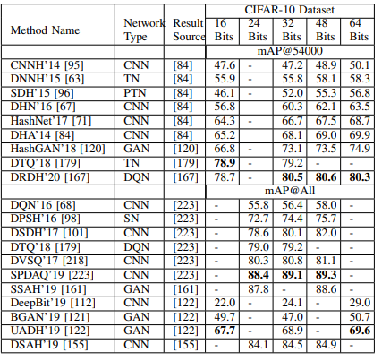

# IX. SO SÁNH HIỆU NĂNG (PERFORMANCE COMPARISON)

Bài khảo sát này cũng trình bày một **phân tích hiệu năng (performance analysis)** cho các phương pháp tiếp cận truy xuất ảnh dựa trên học sâu tiên tiến (**state-of-the-art**). Độ chính xác trung bình (Mean Average Precision - **mAP**) được báo cáo cho các phương pháp tiếp cận truy xuất ảnh khác nhau được tóm tắt trong Bảng II, III và IV.

*   **mAP@5000** (tức là 5000 ảnh được truy xuất) sử dụng các phương pháp học sâu hiện có khác nhau được tóm tắt trong **Bảng II** trên các tập dữ liệu **CIFAR-10, NUS-WIDE và MS COCO**.
*   Các kết quả trên các tập dữ liệu **CIFAR-10, ImageNet và MNIST** sử dụng các phương pháp truy xuất ảnh dựa trên học sâu tiên tiến khác nhau được biên soạn trong **Bảng III** về **mAP@1000**.
*   **mAP@54000** sử dụng một vài phương pháp được báo cáo trong **Bảng IV** trên tập dữ liệu **CIFAR-10**.
*   **mAP tiêu chuẩn (standard mAP)** cũng được mô tả trong Bảng IV bằng cách xem xét **tất cả các ảnh được truy xuất (all the retrieved images)** cho tập dữ liệu CIFAR-10 sử dụng một số tài liệu có sẵn.

BẢNG IV: mAP@54000 và mAP@All tính theo % cho các phương pháp truy xuất hình ảnh hiện đại và mới nhất trên tập dữ liệu CIFAR-10.

Lưu ý rằng **cột thứ 2** trong Bảng II, III và IV liệt kê **nguồn tham khảo (source reference)** của phương pháp tương ứng mà kết quả được báo cáo.

Sau đây là các **nhận xét (observations)** rút ra từ những kết quả này bởi các phương pháp học sâu:

*   Phương pháp **Băm Chuyển tiếp Sâu (Deep Transfer Hashing - DTH)** được đề xuất gần đây bởi Zhai et al. (2020) [225] đã cho thấy hiệu năng **xuất sắc (outstanding performance)** trên các tập dữ liệu CIFAR-10 và NUS-WIDE về mAP@5000. Các phương pháp đầy hứa hẹn khác bao gồm:
    *   **Băm Chú ý Không gian Sâu (Deep Spatial Attention Hashing - DSAH)** bởi Ge et al. (2019) [155]
    *   **Lượng tử hóa Bất đối xứng Sâu Bảo toàn Độ tương tự (Similarity Preserving Deep Asymmetric Quantization - SPDAQ)** bởi Chen et al. (2019) [223]
    *   **Băm Nhận biết Vị trí Sâu (Deep Position-Aware Hashing - DPAH)** bởi Wang et al. (2020) [89]
    *   **Băm Giảm dư thừa bằng Học Củng cố Sâu (Deep Reinforcement De-Redundancy Hashing - DRDH)** bởi Yang et al. (2020) [167]

*   Phương pháp **Băm Nút thắt Cổ chai Đôi (Twin-Bottleneck Hashing - TBH)** được giới thiệu bởi Shen et al. (2020) [87] cũng được quan sát thấy là một phương pháp **hấp dẫn (appealing)** sử dụng mã tự động có **nút thắt cổ chai kép (double bottleneck)** trên tập dữ liệu CIFAR-10 về mAP@1000. Tuy nhiên, phương pháp **Băm Nhận biết Vị trí Sâu (DPAH)** được nghiên cứu bởi Wang et al. (2020) [89] đã **vượt trội hơn (outperformed)** các phương pháp tiếp cận khác trên tập dữ liệu ImageNet. Phương pháp **Băm Sâu có Giám sát (Supervised Deep Hashing - SDH)** bởi Erin et al. (2015) [110] đã thể hiện hiệu năng hấp dẫn trên tập dữ liệu MNIST.

*   Mô hình truy xuất ảnh dựa trên **học củng cố sâu (deep reinforcement learning)**, namely **Băm Giảm dư thừa bằng Học Củng cố Sâu (Deep Reinforcement De-Redundancy Hashing - DRDH)** bởi Yang et al. (2020) [167], là một trong những **đột phá (breakthrough)** gần đây, được chứng minh bằng chỉ số mAP@54000 **tuyệt vời (superlative)** trên tập dữ liệu CIFAR-10. **Lượng tử hóa Bộ ba Sâu (Deep Triplet Quantization)** [179] cũng là một trong những mô hình **ưa thích (favourable)** cho việc học đặc trưng.

*   Các phương pháp **Lượng tử hóa Bất đối xứng Sâu Bảo toàn Độ tương tự (SPDAQ)** bởi Chen et al. (2019) [223] và **Băm Đối kháng Không giám sát (Unsupervised ADversarial Hashing - UADH)** bởi Deng et al. (2019) [122] cũng đã được xác định là **rất khích lệ (very encouraging)** dựa trên chỉ số mAP khi xem xét tất cả các ảnh được truy xuất trên tập dữ liệu CIFAR-10.