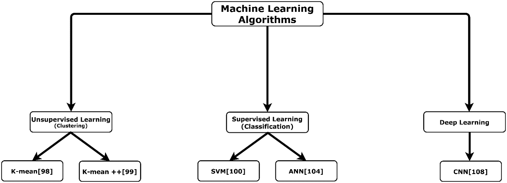
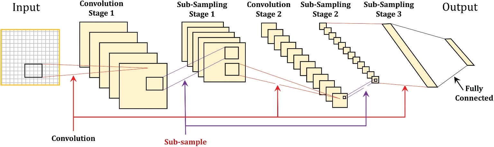

# 4. Học máy (Machine Learning)

Gần đây, các hệ thống CBIR đã chuyển hướng sang sử dụng các thuật toán học máy để xây dựng mô hình có khả năng xử lý dữ liệu đầu vào mới và đưa ra dự đoán chính xác hơn, từ đó cải thiện việc tìm kiếm hình ảnh.

Các thuật toán học máy phổ biến nhất được sử dụng trong miền CBIR bao gồm:

- **Học có giám sát (Supervised Learning)**: yêu cầu dữ liệu được gán nhãn, sau đó mô hình được huấn luyện để phân loại hoặc dự đoán nhãn cho dữ liệu mới. Các kỹ thuật phổ biến: **SVM (Support Vector Machine)** và **ANN (Artificial Neural Networks)**.

- **Học không giám sát (Unsupervised Learning)**: không yêu cầu dữ liệu được gán nhãn. Các thuật toán học cách phát hiện mẫu, nhóm (cluster) dữ liệu có cùng đặc điểm. Kỹ thuật phổ biến: **K-means, K-means++**.

- **Học sâu (Deep Learning)**: có thể được huấn luyện theo cách có giám sát hoặc không giám sát. Các mô hình học sâu (ví dụ: **CNN, Deep Belief Network, Boltzmann Machine**) có khả năng tự động trích xuất đặc trưng từ dữ liệu, từ đó vượt trội trong các tác vụ nhận dạng và tìm kiếm hình ảnh.

【Hình 4】 trình bày cây phân loại các thuật toán học máy.

## Figure 4. Machine learning algorithms.

---

## 4.1. Học có giám sát (Supervised Learning)

Trong học có giám sát, mô hình được huấn luyện từ tập dữ liệu đã gán nhãn. Mỗi mẫu huấn luyện bao gồm **đặc trưng (features)** và **nhãn (label)**. Mục tiêu là xây dựng mô hình để dự đoán nhãn cho dữ liệu mới.

**Ứng dụng trong CBIR:**

- Gán nhãn cho hình ảnh (ví dụ: “chó”, “mèo”, “xe hơi”).
- Huấn luyện mô hình phân loại để tìm kiếm ảnh trong tập dữ liệu lớn.

**Các thuật toán tiêu biểu:**

- **SVM**: tìm siêu phẳng tối ưu để tách dữ liệu thành các lớp. Bền vững với dữ liệu có số chiều lớn.
- **ANN**: mạng nơ-ron nhân tạo, mô phỏng cách hoạt động của não người, có thể học các mối quan hệ phức tạp giữa dữ liệu và nhãn.

---

### 4.1.1. Support Vector Machine (SVM)

SVM là một trong những thuật toán học có giám sát phổ biến nhất được sử dụng trong CBIR.

- **Nguyên lý:** tìm một siêu phẳng (hyperplane) tối ưu để phân tách dữ liệu thuộc các lớp khác nhau sao cho khoảng cách (margin) giữa các lớp là lớn nhất.
- Các điểm nằm gần siêu phẳng nhất được gọi là **vector hỗ trợ (support vectors)**.
- Ưu điểm: hoạt động tốt với dữ liệu có số chiều cao, hiệu quả trong các bài toán phân loại nhị phân.

【Hình 5】 minh họa cơ chế phân loại của SVM, trong đó siêu phẳng tối ưu được chọn để tối đa hóa khoảng cách giữa **Class 1** và **Class 2**.

## Figure 5. SVM classifier.

Trong CBIR, SVM thường được sử dụng kết hợp với các mô tả đặc trưng (ví dụ: SIFT, HOG, LBP) để phân loại ảnh, từ đó cải thiện hiệu quả truy hồi.

---

## 4.1.2. Artificial Neural Networks (ANN)

Mạng nơ-ron nhân tạo là một lớp thuật toán học máy lấy cảm hứng từ cấu trúc và cơ chế xử lý của não bộ.

- **Cấu trúc:** bao gồm các lớp đầu vào, lớp ẩn và lớp đầu ra.
- Mỗi nơ-ron nhân tạo (node) thực hiện phép tính trên đầu vào và truyền tín hiệu qua hàm kích hoạt.
- **Ưu điểm:** có khả năng học quan hệ phi tuyến phức tạp.
- **Nhược điểm:** yêu cầu nhiều dữ liệu huấn luyện, dễ bị overfitting.

Trong CBIR, ANN được dùng để **học các đặc trưng ngữ nghĩa** từ đặc trưng mức thấp, nhằm thu hẹp khoảng cách ngữ nghĩa (semantic gap).
Ví dụ: ANN có thể học cách ánh xạ từ các vector màu/kết cấu sang khái niệm ngữ nghĩa như “hoa”, “xe hơi”, “động vật”.

---

## 4.2. Học không giám sát (Unsupervised Learning)

Không yêu cầu dữ liệu được gán nhãn. Thuật toán học không giám sát tìm cách nhóm dữ liệu dựa trên sự tương đồng.

**Ứng dụng trong CBIR:**

- Tự động nhóm ảnh thành các cụm (clusters) mà không cần nhãn trước.
- Giúp giảm khoảng cách ngữ nghĩa bằng cách học quan hệ giữa các đặc trưng ảnh.

**Thuật toán phổ biến:**

- **K-means**: phân cụm dữ liệu thành _k_ nhóm dựa trên khoảng cách Euclidean.
- **K-means++**: cải tiến quá trình chọn tâm cụm ban đầu, giúp hội tụ nhanh hơn và giảm khả năng rơi vào nghiệm cục bộ.

---

## 4.3. Học sâu (Deep Learning)

Học sâu là một nhánh đặc biệt của học máy, có thể giám sát hoặc không giám sát.

**Đặc điểm:**

- Tự động học đặc trưng từ dữ liệu thô (raw data).
- Cấu trúc nhiều tầng, cho phép học các biểu diễn trừu tượng phức tạp.
- Cần nhiều tài nguyên tính toán (GPU, TPU) và dữ liệu lớn để đạt hiệu năng cao.

**Ứng dụng trong CBIR:**

- **CNN (Convolutional Neural Network):** dùng rộng rãi trong CBIR để tự động trích xuất đặc trưng hình ảnh, vượt trội so với các phương pháp thủ công (hand-crafted features).
- **Deep Belief Network (DBN), Boltzmann Machine:** học biểu diễn phi tuyến sâu, nhưng ít được dùng trong CBIR so với CNN.

### Convolutional Neural Networks (CNN)

CNN là một trong những kiến trúc học sâu mạnh mẽ nhất và hiện được coi là chuẩn mực trong CBIR.

- **Đặc điểm chính:**

  - Tự động học đặc trưng hình ảnh từ dữ liệu thô, không cần trích xuất thủ công.
  - Các tầng tích chập (convolutional layers) phát hiện các mẫu cục bộ như cạnh, góc, kết cấu.
  - Các tầng pooling giảm kích thước, giữ lại thông tin quan trọng.
  - Các tầng fully connected dùng để phân loại cuối cùng.

【Hình 6】 cho thấy ví dụ kiến trúc CNN gồm các tầng tích chập (convolution), lấy mẫu phụ (sub-sampling), và tầng kết nối đầy đủ (fully connected).

## Figure 6. An example of CNN architecture

- **Ưu điểm:** độ chính xác rất cao, có khả năng học biểu diễn phức tạp.
- **Nhược điểm:** chi phí tính toán lớn, cần tập dữ liệu huấn luyện khổng lồ, yêu cầu GPU mạnh.

Trong CBIR, CNN đã chứng minh hiệu năng vượt trội, đặc biệt khi xử lý các tập dữ liệu quy mô lớn (Oxford, Paris, Corel, ImageNet).

---

# 5. So sánh giữa các phương pháp tiên tiến (Comparison among the state-of-the-art approaches)

Trong phần này, sáu nghiên cứu đạt độ chính xác cao nhất sẽ được thảo luận, bao gồm: **trích xuất đặc trưng toàn cục** (Srivastava & Khare, 2017; Phadikar et al., 2018), **trích xuất đặc trưng cục bộ** (Sarwar et al., 2019; Yousuf et al., 2018), và **các phương pháp dựa trên học máy** (Tzelepi & Tefas, 2018; Sezavar et al., 2019).

Tất cả các nghiên cứu được đề cập trong phần này đều sử dụng bộ dữ liệu **COREL**, ngoại trừ các nghiên cứu dựa trên học máy, vốn sử dụng **Paris6k** và **ALOI**.

---

### Phương pháp dựa trên đặc trưng toàn cục

- **Srivastava & Khare (2017)** đạt độ chính xác cao nhất (**0.9995**) bằng cách trích xuất đặc trưng **kết cấu** và **hình dạng**.

  - **DWT (biến đổi wavelet rời rạc)** được dùng để trích xuất kết cấu, sau đó là **LBP (Local Binary Pattern)**.
  - Wavelet cung cấp thông tin hướng, khắc phục hạn chế của LBP.
  - LBP mô tả cấu trúc mức xám, tính toán đơn giản, ít nhạy với thay đổi mức xám nhưng nhạy cảm với nhiễu và thiếu thông tin không gian.
  - Do đó, các tác giả sử dụng thêm **Legendre moments**, thuộc nhóm moment trực giao liên tục, thường dùng để mô tả hình dạng vì giúp giảm dư thừa thông tin và tái tạo tín hiệu.
  - Nhược điểm: moment trực giao liên tục phức tạp tính toán, tăng thời gian truy hồi. DWT cũng nhạy cảm với nhiễu.
  - Kết quả: đạt độ chính xác cao ở mức phân rã wavelet cấp 7, nhưng độ chính xác suy giảm khi tập dữ liệu lớn hơn → hiệu quả thấp với cơ sở dữ liệu lớn.

- **Phadikar et al. (2018)** đạt độ chính xác cao thứ hai.

  - Hệ thống CBIR được đề xuất trong **miền nén (Discrete Cosine Domain)**.
  - Trích xuất **Color moments, Color histogram, Edge histogram** trực tiếp từ miền nén.
  - Color moment và histogram đơn giản, ít tốn tính toán nhưng không có thông tin không gian → do đó dùng thêm edge histogram để biểu diễn kết cấu.
  - Edge histogram mô tả phân bố cạnh cục bộ, theo chuẩn MPEG (Won et al., 2002). Tuy nhiên, không đủ để mô tả cạnh toàn cục.
  - Để thu hẹp khoảng cách ngữ nghĩa, các tác giả gán trọng số khác nhau cho đặc trưng bằng **thuật toán di truyền (GA)**.
  - Kết quả: độ chính xác tăng đáng kể nhờ GA, nhưng thời gian tính toán cũng tăng. Việc trích xuất đặc trưng trong miền nén giúp bù đắp chi phí tính toán, nên thời gian tổng thể vẫn hợp lý.

---

### Phương pháp dựa trên đặc trưng cục bộ

- **Sarwar et al. (2019)** đạt độ chính xác cao nhất với phương pháp dựa trên **LBPV** và **LIOP**.

  - LBPV khắc phục hạn chế mất thông tin không gian toàn cục của LBP, nhưng chi phí tính toán cao.
  - LIOP là bộ mô tả có tính phân biệt cao, mã hóa cả thứ tự cường độ toàn cục và cục bộ trong mỗi patch ảnh.
  - LIOP bất biến với thay đổi cường độ đơn điệu, nén JPEG, mờ, xoay ảnh, thay đổi góc nhìn.
  - Hai bộ mô tả được dùng để xây dựng hai từ điển trực quan nhỏ, sau đó nối lại thành một từ điển lớn. PCA được áp dụng để giảm chiều, histogram được tính toán và SVM được huấn luyện dựa trên LBPV + LIOP.
  - Kết quả: hệ thống hiệu quả về precision, recall và chi phí tính toán.
  - Hạn chế: chưa thử nghiệm trên tập dữ liệu lớn (ImageNet, ImageCLEF). Không thể dùng trực tiếp cho ảnh đa phổ → gây mất thông tin phổ và không gian.

- **Yousuf et al. (2018)** đạt độ chính xác cao thứ hai.

  - CBIR được đề xuất dựa trên **SIFT** và **LIOP**.
  - LIOP khắc phục hạn chế của SIFT trong thay đổi ánh sáng và cảnh có độ tương phản thấp.
  - LIOP yếu khi thay đổi tỷ lệ, trong khi SIFT lại mạnh.
  - Hai bộ mô tả được kết hợp thành từ trực quan (visual words) dựa trên mô hình **BoVW (Bag-of-Visual-Words)**.
  - Sau đó áp dụng **K-means clustering**, tính histogram cho từng ảnh. Histogram này được đưa vào **SVM** để phân loại.
  - Kết quả: hiệu quả về độ chính xác trung bình (MAP), nhưng SIFT vẫn được xem là bộ mô tả có số chiều cao, gây tốn tài nguyên.

---

### Phương pháp dựa trên học máy

- **Tzelepi & Tefas (2018)** đạt độ chính xác cao nhất.

  - Sử dụng **CNN** để trích xuất đặc trưng, áp dụng **max pooling** sau các tầng convolution thay vì fully connected.
  - Ưu điểm: giữ lại thông tin không gian, giảm chiều descriptor, tăng hiệu quả truy hồi, đồng thời tiết kiệm bộ nhớ.
  - Ứng dụng tiềm năng: robot, drone, smartphone (tài nguyên hạn chế).
  - Nhược điểm: không dùng kỹ thuật lập chỉ mục nên thời gian truy hồi tăng.

- **Sezavar et al. (2019)** đạt độ chính xác cao thứ hai.

  - Đề xuất CBIR kết hợp **CNN** và **biểu diễn thưa (sparse representation)**.
  - CNN được dùng để trích xuất đặc trưng mức cao và phân loại ảnh truy vấn. Sparse representation giúp giảm chi phí tính toán.
  - Sparse representation tuy giảm độ chính xác nhưng tăng tốc truy hồi.
  - Để tăng hiệu quả, các tác giả sử dụng **AlexNet**, trích xuất đặc trưng từ lớp cuối cùng (nhỏ nhất), giảm chi phí tính toán.
  - Kết quả: CBIR hiệu quả hơn về tốc độ, nhưng cần cân bằng giữa độ chính xác và thời gian truy hồi.

---

### 【Bảng 3】

**Đặc điểm chính, hạn chế và ví dụ của các nhóm học máy chính**

| Phương pháp                                                 | Đặc điểm chính                                                                                                          | Hạn chế                                                                               | Ví dụ                                                            |
| ----------------------------------------------------------- | ----------------------------------------------------------------------------------------------------------------------- | ------------------------------------------------------------------------------------- | ---------------------------------------------------------------- |
| **Học có giám sát (Supervised Learning – Classification)**  | - Cần nhãn dữ liệu. - Dự đoán và phân loại vào lớp xác định.                                                         | - Kích thước tập huấn luyện ảnh hưởng trực tiếp đến độ chính xác.                     | SVM, ANN                                                         |
| **Học không giám sát (Unsupervised Learning – Clustering)** | - Không cần nhãn dữ liệu. - Học sự tương đồng và ngữ nghĩa giữa dữ liệu, khái quát hóa mô hình để xử lý dữ liệu mới. | - Dễ overfitting. - Khó mở rộng quy mô. - Số lượng cụm ảnh hưởng đến hiệu suất. | K-means, K-means++                                               |
| **Học sâu (Deep Learning)**                                 | - Có thể giám sát hoặc không giám sát. - Sinh mô hình học tự động.                                                   | - Chi phí tính toán rất cao. - Cấu trúc phức tạp.                                  | CNN, Deep Neural Network, Deep Belief Network, Boltzmann Machine |

Bảng 3 so sánh ba nhóm chính:

- Học có giám sát (ví dụ: SVM, ANN)
- Học không giám sát (ví dụ: K-means, K-means++)
- Học sâu (ví dụ: CNN, DBN)

---

### 【Bảng 4】

**Tóm tắt hiệu năng của các thuật toán học máy trong CBIR**

| Tham khảo              | Thuật toán                    | Bộ dữ liệu                                  | Độ chính xác                   | Vấn đề                                                                               | Hạn chế                                                               |
| ---------------------- | ----------------------------- | ------------------------------------------- | ------------------------------ | ------------------------------------------------------------------------------------ | --------------------------------------------------------------------- |
| Yousuf et al. (2018)   | K-means, SVM                  | Corel 1k, Corel 1.5k, Caltech 256           | 0.8730, 0.8520, 0.3030         | Giảm khoảng cách ngữ nghĩa giữa đặc trưng mức cao & thấp.                            | Descriptor số chiều lớn.                                              |
| Sarwar et al. (2019)   | SVM                           | WANG 1k, WANG 1.5k, Holiday                 | 0.8958, 0.7602, 0.6923         | - Giảm khoảng cách ngữ nghĩa. - Bất biến với xoay, ánh sáng. - PCA giảm chiều. | Chưa kiểm chứng trên tập lớn. Không dùng cho ảnh đa phổ.           |
| Mehmood et al. (2018)  | K-means++, SVM                | Corel 1k, Corel 1.5k, Corel 5k, Caltech 256 | 0.8061, 0.7628, 0.6060, 0.4630 | Cung cấp thông tin không gian, hoạt động tốt trong nhiễu & ánh sáng yếu.             | HOG không dùng cho ảnh đa phổ.                                        |
| Ashraf et al. (2015)   | ANN                           | Corel, Coil, Caltech 101                    | 0.8200                         | Truy hồi dựa trên đối tượng chính trong ảnh.                                         | Phân đoạn làm chậm hệ thống.                                          |
| AlZu’bi et al. (2017)  | CNN                           | Oxford 5k, Oxford 105k                      | 0.9570, 0.8860                 | Không cần nhãn. Vector ngắn (16). Giảm bộ nhớ và thời gian.                    | Độ chính xác giảm khi dữ liệu lớn.                                    |
| Tzelepi & Tefas (2018) | CNN (giám sát/không giám sát) | Paris 6k, UKBench                           | 0.9859, 0.8347                 | Giảm chiều descriptor, giữ thông tin không gian.                                     | Thời gian truy hồi tăng.                                              |
| Q. Zheng et al. (2019) | CNN                           | Caltech 101, Holiday, Oxford                | 0.8850, 0.9410, 0.9620         | Sử dụng VGG-16, so sánh độ tương đồng.                                               | Cần tăng tốc huấn luyện, tốn thời gian xây dựng dữ liệu trọng trường. |
| Sezavar et al. (2019)  | CNN                           | Corel, ALOI, MPEG-7                         | 0.9559, 0.9706, 0.7749         | Giảm chi phí tính toán.                                                              | Thời gian truy hồi tăng nếu không dùng sparse representation.         |

Bảng 4 cho thấy hiệu năng cụ thể của từng thuật toán học máy trong CBIR.
Ví dụ:

- CNN của Tzelepi & Tefas (2018) đạt **98.59%** trên Paris6k.
- CNN của Sezavar et al. (2019) đạt **97.06%** trên Corel.
- SVM của Sarwar et al. (2019) đạt **89.58%** trên WANG-1k.
- ANN của Ashraf et al. (2015) đạt **82%** trên Corel, Coil, Caltech.

---

### 【Bảng 5】

**So sánh các kỹ thuật CBIR khác nhau**

| Tham khảo                 | Phương pháp trích xuất | Độ chính xác | Điểm mạnh                                                                                                          | Hạn chế                                                       |
| ------------------------- | ---------------------- | ------------ | ------------------------------------------------------------------------------------------------------------------ | ------------------------------------------------------------- |
| Srivastava & Khare (2017) | Toàn cục               | 0.9999       | - Cung cấp thông tin hướng & không gian. - Bất biến với thay đổi tỷ lệ, xoay.                                   | Tăng độ phức tạp tính toán. DWT nhạy với nhiễu.            |
| Phadikar et al. (2018)    | Toàn cục               | 0.9850       | - Xem xét đồng thời màu, kết cấu, hình dạng. - GA tăng độ chính xác.                                            | GA làm tăng chi phí tính toán.                                |
| Sarwar et al. (2019)      | Cục bộ                 | 0.8958       | - Giảm khoảng cách ngữ nghĩa. - Bất biến với xoay, ánh sáng. - PCA giảm chiều.                               | Không thử trên tập lớn. Mất thông tin phổ và không gian.   |
| Yousuf et al. (2018)      | Cục bộ                 | 0.8730       | - Giảm khoảng cách ngữ nghĩa. - Bất biến với xoay, chiếu sáng, tỷ lệ. - Hoạt động tốt trong tương phản thấp. | Descriptor số chiều cao.                                      |
| Tzelepi & Tefas (2018)    | CNN                    | 0.9859       | - Giảm chiều descriptor. - Giữ thông tin không gian.                                                            | Thời gian truy hồi tăng.                                      |
| Sezavar et al. (2019)     | CNN                    | 0.9706       | Giảm chi phí tính toán.                                                                                            | Thời gian truy hồi tăng nếu không dùng sparse representation. |

Bảng 5 so sánh giữa **global feature, local feature và CNN**, kết luận rằng **CNN thường vượt trội hơn cả hai loại đặc trưng thủ công**.
