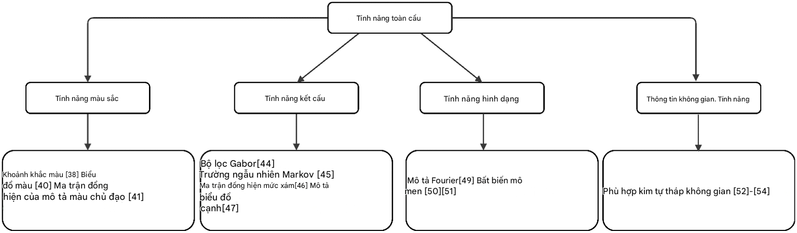

# 3. Đặc trưng mức thấp (Low-level features)

Như đã đề cập, quá trình trích xuất và lựa chọn đặc trưng – vốn đại diện cho nội dung ngữ nghĩa của hình ảnh – đóng vai trò then chốt trong CBIR. Các đặc trưng này có thể được chia thành:

- **Đặc trưng toàn cục (global features)**: màu sắc, kết cấu, hình dạng và thông tin không gian, mô tả toàn bộ hình ảnh.
- **Đặc trưng cục bộ (local features)**: thường được thu được thông qua việc chia ảnh thành nhiều vùng (segment) hoặc tính toán các điểm đặc trưng như góc, blob, và cạnh.

Đặc trưng cục bộ có tính bất biến đối với thay đổi về tỷ lệ, tịnh tiến và xoay (Low, 2004).

Cả hai loại đặc trưng sẽ được giải thích chi tiết trong phần này, cùng với tổng quan các nghiên cứu gần đây để chứng minh tầm quan trọng của việc lựa chọn đặc trưng và tác động của chúng đến hiệu năng hệ thống.

---

## 3.1. Đặc trưng toàn cục (Global features)

## Màu sắc, kết cấu, hình dạng và thông tin không gian là những đặc trưng được sử dụng rộng rãi trong các tác vụ truy hồi ảnh. Những đặc trưng này sẽ được thảo luận ngắn gọn dưới đây. 【Hình 2】 minh họa phân loại các đặc trưng toàn cục cùng với một số phương pháp trích xuất đặc trưng.

### 3.1.1. Đặc trưng màu sắc (Color feature)

Vì mắt người có thể phân biệt hình ảnh dựa trên màu sắc, đặc trưng màu được coi là một trong những đặc trưng quan trọng nhất và thường xuyên được các nhà nghiên cứu sử dụng.

Đặc trưng màu được tính toán dựa trên các **không gian màu**. Các không gian màu phổ biến nhất trong CBIR là **HSV (LSV)**, **YCbCr**, **RGB**, và **LAB**.

Chúng được mô tả thông qua các đại lượng:

- **Color moments** (Duanmu, 2010)
- **Color correlogram** (Huang và cộng sự, 1997)
- **Color histogram** (Flickner và cộng sự, 1995)
- **Dominant color descriptor**
- **Color co-occurrence matrix** (Qiu, 2003)
- Và nhiều bộ mô tả khác.

Đặc trưng màu được coi là bền vững vì chúng bất biến trước dịch chuyển, xoay, và thay đổi tỷ lệ (Shrivastava & Tyagi, 2015). Tuy nhiên, chúng lại bị hạn chế về thông tin không gian, do đó cần bổ sung thêm các mô tả khác để khắc phục nhược điểm này (Alzu’bi và cộng sự, 2015).

---

### 3.1.2. Đặc trưng kết cấu (Texture)

Kết cấu là những mẫu thị giác rõ ràng nhưng không thể biểu diễn chỉ bằng một cường độ hoặc một màu duy nhất.

Kết cấu là đặc trưng then chốt trong thị giác máy tính vì nó hiện diện trong nhiều hình ảnh thực tế, do đó thường được dùng trong truy hồi ảnh và nhận dạng mẫu.

Hạn chế chính của các phương pháp dựa trên kết cấu là **độ phức tạp tính toán cao** và **nhạy cảm với nhiễu** (Alzu’bi và cộng sự, 2015; D. P. Tian, 2013).

Một số thuật toán phân tích kết cấu phổ biến:

- **Bộ lọc Gabor** (Manjunath và cộng sự, 2001)
- **Mô hình ngẫu nhiên Markov (MRF)** (Cross & Jain, 1983)
- **Biến đổi wavelet**
- **Steerable pyramid decomposition**
- **Ma trận đồng xuất hiện mức xám (GLCM)** (Hawlick, 2017)
- **Mô tả histogram cạnh (EHD)** (Won và cộng sự, 2002).

---

### 3.1.3. Đặc trưng hình dạng (Shape)

Hình dạng là một trong các đặc trưng mức thấp giúp nhận dạng đối tượng.

Việc trích xuất hình dạng có thể dựa trên **vùng (region-based)** hoặc **đường bao (boundary-based/contour)** (D. P. Tian, 2013; Zhang & Lu, 2004).

- Với phương pháp dựa trên vùng: trích xuất trong toàn bộ khu vực đối tượng.
- Với phương pháp dựa trên đường bao: trích xuất trên biên của vùng.

Một số phương pháp trích xuất đặc trưng hình dạng:

- **Fourier descriptor** (Zhang & Lu, 2001)
- **Moment invariants** (Marxsen và cộng sự, 1993; Suk & Flusser, 2011).

Nói chung, các mô tả hình dạng biến đổi theo tỷ lệ và tịnh tiến, vì vậy thường được kết hợp với các mô tả khác để tăng độ chính xác.

---

### 3.1.4. Thông tin không gian (Spatial information)

Hầu hết các phương pháp trích xuất đặc trưng mức thấp đã bàn ở trên đều thiếu thông tin không gian.

Đặc trưng không gian liên quan đến vị trí của đối tượng trong một hình ảnh 2D. Ví dụ: hai vùng khác nhau với nội dung không gian khác nhau trong cùng một hình ảnh có thể cho ra histogram giống nhau.

Thông tin không gian thường gặp phải **độ phức tạp tính toán cao**.
Một trong những phương pháp tốt nhất để nắm bắt thuộc tính không gian của hình ảnh là **Spatial Pyramid Matching** (Lazebnik và cộng sự, 2006; Naeem và cộng sự, 2017; Mehmood và cộng sự, 2016).
