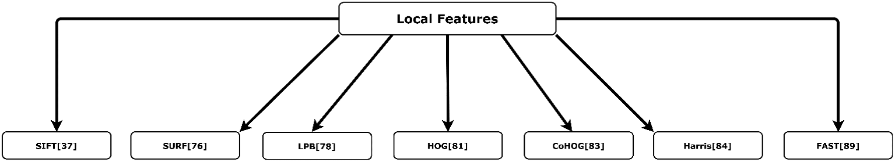

# 3.2. Đặc trưng cục bộ (Local features)

Trong khi nhiều nghiên cứu CBIR sử dụng đặc trưng toàn cục và đạt độ chính xác tốt, các đặc trưng cục bộ ngày càng phổ biến vì chúng vượt trội hơn ở tính **bất biến với tỷ lệ và xoay**, và cung cấp khả năng so khớp đáng tin cậy trong nhiều điều kiện khác nhau (Low, 2004).

Các bộ dò và mô tả đặc trưng cục bộ phổ biến nhất được liệt kê trong 【Hình 3】.

---

## 3.2.1. Biến đổi đặc trưng bất biến theo tỷ lệ (SIFT)

**Scale-Invariant Feature Transform (SIFT)** là một trong những mô tả cục bộ được sử dụng rộng rãi nhất, được David Lowe giới thiệu (Low, 2004).

- SIFT bao gồm cả **bộ dò (detector)** và **bộ mô tả (descriptor)** cho các điểm đặc trưng.
- Bền vững trước xoay và thay đổi tỷ lệ ảnh.
- Nhược điểm:

  - Kém hiệu quả khi so khớp trong không gian đặc trưng có số chiều cao.
  - Cần vector kích thước cố định để mã hóa cho việc kiểm tra độ tương tự.
  - Sử dụng nhiều bộ nhớ và chi phí tính toán cao (Montazer & Giveki, 2015).

**Montazer & Giveki (2015):**

- Đề xuất hệ thống CBIR dựa trên SIFT kết hợp với **Local Derivative Pattern (LDP)** để xây dựng mô tả đặc trưng.
- Đưa ra 2 phương pháp giảm chiều của SIFT để khắc phục hạn chế về bộ nhớ và chi phí tính toán.
- Thử nghiệm trên 4 tập dữ liệu.
- Kết quả: hiệu năng truy hồi cao đối với ảnh có đối tượng, nhưng cần cải thiện cho ảnh tự nhiên.

**Sharif et al. (2019):**

- Đề xuất CBIR kết hợp **SIFT** và **BRISK (Binary Robust Invariant Scalable Keypoints)**.
- BRISK bù đắp hạn chế của SIFT trong điều kiện ánh sáng yếu và khi điểm đặc trưng định vị kém (Leutenegger et al., 2011).
- Chi phí tính toán có thể giảm bằng cách chọn tỉ lệ đặc trưng ảnh khác nhau.
- Hạn chế: chưa thử nghiệm trên tập dữ liệu lớn không gán nhãn.

**Yousuf et al. (2018):**

- CBIR dựa trên **SIFT** và **LIOP (Local Intensity Order Pattern)**.
- LIOP giúp khắc phục hạn chế của SIFT trong điều kiện thay đổi chiếu sáng và cảnh có độ tương phản thấp.
- Nhược điểm: LIOP yếu khi thay đổi tỷ lệ, trong khi SIFT lại mạnh.
- Hai mô tả này được kết hợp thành các **từ trực quan (visual words)** theo mô hình **Bag-of-Visual-Words (BoVW)**.
- Sau đó dùng **k-means clustering** và tính histogram cho mỗi ảnh.
- Histogram được đưa vào **SVM** để phân loại.
- Thử nghiệm trên 3 tập dữ liệu (Caltech 101, Corel A, Corel B).
- Kết quả: hiệu quả về độ chính xác trung bình (MAP) và recall, chi phí tính toán hợp lý.

---

## 3.2.2. Đặc trưng SURF

**Speeded-Up Robust Features (SURF)** được Bay và cộng sự (2008) giới thiệu, nhằm khắc phục hạn chế số chiều cao của SIFT.

- SURF nhanh hơn và bền vững hơn SIFT vì tính toán và so khớp đặc trưng ít tốn thời gian hơn, nhờ lược đồ lập chỉ mục dựa trên dấu Laplacian.
- Tuy nhiên, SURF hoạt động kém khi ảnh bị xoay.

**Jabeen et al. (2018):**

- Đề xuất CBIR dựa trên **SURF** và **FREAK (Fast Retina Keypoint)**.
- FREAK phân loại tốt hơn SURF, nhưng SURF lại bền hơn khi thay đổi ánh sáng và tỷ lệ.
- Kết hợp hai mô tả thành **visual words** theo BoVW.
- Áp dụng **K-means clustering**, tính histogram và huấn luyện **SVM**.
- Thử nghiệm trên 3 tập dữ liệu (Caltech 256, Corel 1000, Corel 1500).
- Kết quả: hiệu quả về độ chính xác trung bình (MAP), recall, và chi phí tính toán.
- Hạn chế: SURF và FREAK không cung cấp thông tin màu.

---

## 3.2.3. Local Binary Pattern (LBP)

**LBP** được Ojala và cộng sự (2002) giới thiệu, dựa trên mô hình mức định tính cho các mẫu cục bộ.

- Cách hoạt động: so sánh điểm ảnh trung tâm với 8 điểm lân cận. Điểm ảnh trung tâm được dùng làm ngưỡng.
- Ưu điểm: bất biến trước biến đổi đơn điệu về thang xám, tính toán đơn giản.
- Nhược điểm: mất thông tin không gian toàn cục.

**Guo et al. (2010):**

- Đề xuất **LBP Variance (LBPV)**, một biến thể của LBP, nhằm khắc phục nhược điểm.
- LBPV thực hiện phép quay bất biến toàn cục sau khi tính LBP cục bộ.
- Đề xuất thêm phương pháp đo tương tự để giảm kích thước đặc trưng.

**Sarwar et al. (2019):**

- Đề xuất CBIR kết hợp **LBPV** và **LIOP** để giảm khoảng cách ngữ nghĩa.
- Tạo hai từ điển trực quan nhỏ, ghép lại thành từ điển lớn.
- Sử dụng **PCA** để giảm chiều, tính histogram và huấn luyện **SVM**.
- Thử nghiệm trên 3 tập dữ liệu (Holidays, WANG-1k, WANG-2k).
- Kết quả: hiệu quả về precision, recall và chi phí tính toán.
- Hạn chế: chưa thử nghiệm trên tập dữ liệu lớn như ImageNet hoặc ImageCLEF, không áp dụng trực tiếp cho ảnh đa phổ (multispectral).

---

### 【Bảng 2】

**Tóm tắt các nghiên cứu về phương pháp dựa trên đặc trưng cục bộ (Local feature-based methods)**

| Tham khảo                | Bộ mô tả (Descriptor) | Bộ dữ liệu                                     | Độ chính xác                           | Vấn đề                                                                                                                                                                  | Hạn chế                                                                                         |
| ------------------------ | --------------------- | ---------------------------------------------- | -------------------------------------- | ----------------------------------------------------------------------------------------------------------------------------------------------------------------------- | ----------------------------------------------------------------------------------------------- |
| Montazer & Giveki (2015) | SIFT, LDP             | Wang, OT, FP, LSP                              | 0.8850, 0.9407, 0.8860, 0.8830         | Hiệu năng cao với ảnh có đối tượng.                                                                                                                                     | - Độ dài vector đặc trưng là 3000. - Cần cải thiện cho ảnh tự nhiên.                         |
| Sharif et al. (2019)     | SIFT, BRISK           | Corel 1k, Corel 1.5k, Corel 5k, Caltech 256    | 0.8439, 0.7814, 0.5737, 0.4752         | Giảm khoảng cách ngữ nghĩa giữa đặc trưng mức cao và mức thấp.                                                                                                          | - Chưa kiểm chứng trên tập dữ liệu lớn không gán nhãn.                                          |
| Yousuf et al. (2018)     | SIFT, LIOP            | Corel 1k, Corel 1.5k, Caltech 256              | 0.8730, 0.8520, 0.3030                 | - Giảm khoảng cách ngữ nghĩa giữa đặc trưng mức cao và mức thấp. - Bất biến với xoay, thay đổi tỷ lệ, chiếu sáng, hoạt động tốt hơn trong điều kiện tương phản thấp. | Descriptor có số chiều cao.                                                                     |
| Jabeen et al. (2018)     | SURF, FREAK           | Corel 1k, Corel 1.5k, Caltech 256              | 0.8600, 0.8320, 0.3898                 | Giảm khoảng cách ngữ nghĩa giữa đặc trưng mức cao và mức thấp.                                                                                                          | Không cung cấp thông tin màu.                                                                   |
| Sarwar et al. (2019)     | LBPV, LIOP            | WANG 1k, WANG 1.5k, Holiday                    | 0.8958, 0.7602, 0.6923                 | - Giảm khoảng cách ngữ nghĩa giữa đặc trưng mức cao và mức thấp. - Sử dụng PCA để giảm chiều dữ liệu.                                                                | - Chưa kiểm chứng trên tập dữ liệu quy mô lớn. - Không thể áp dụng trực tiếp cho ảnh đa phổ. |
| Mehmood et al. (2018)    | HOG, SURF             | Corel 1k, Corel 1.5k, Corel 5k, Caltech 256    | 0.8061, 0.7628, 0.6060, 0.4630         | - Cung cấp thêm thông tin không gian. - Hoạt động tốt hơn trong môi trường nhiễu và ánh sáng yếu.                                                                    | HOG không thể áp dụng trực tiếp cho ảnh đa phổ.                                                 |
| Baig et al. (2020)       | CoHOG, SURF           | Corel 1k, Corel 1.5k, Sense 15, Caltech 256    | 0.8641, 0.7726, 0.8123, 0.6839         | Sử dụng phản hồi liên quan (Relevance Feedback) để tăng độ chính xác.                                                                                                   | Chưa kiểm chứng trên tập dữ liệu quy mô lớn.                                                    |
| Qin et al. (2019)        | Harris, SURF          | Corel 1k                                       | -                                      | Giảm thời gian tìm kiếm.                                                                                                                                                | Với tập dữ liệu ảnh lớn, hiệu quả không lý tưởng.                                               |
| Sharmi et al. (2018)     | FAST                  | Medical dataset                                | -                                      | Sử dụng giao thức dựa trên watermark.                                                                                                                                   | - FAST hoạt động kém trong nhiễu mức cao. - Phụ thuộc vào giá trị ngưỡng.                    |
| M. Zhao et al. (2016)    | MTSD                  | Corel 1k, Corel 5k, Corel 10k, Caltech 50      | 0.7928, 0.6298, 0.5195, 0.4387         | Kích thước descriptor đề xuất là 137.                                                                                                                                   | Thiếu mô tả về sự tương quan.                                                                   |
| Raza et al. (2019)       | STH                   | Corel 5k, Corel 10k                            | 0.6028, 0.4803                         | Liên hệ thông tin màu với hướng kết cấu.                                                                                                                                | Thiếu thông tin cường độ (intensity).                                                           |
| Raza et al. (2018)       | CPV-THF               | Corel 1k, Corel 5k, Corel 10k                  | 0.8079, 0.6390, 0.5228                 | Tích hợp thông tin ngữ nghĩa và nội dung thị giác.                                                                                                                      | Kích thước vector đặc trưng là 242.                                                             |
| Song et al. (2018)       | DTSD                  | Corel 1k, Corel 5k, UCID                       | 0.6119, 0.2019, 0.3367                 | Phân đoạn ảnh thành tiền cảnh và hậu cảnh.                                                                                                                              | Kích thước vector đặc trưng là 692.                                                             |
| Agarwal et al. (2019)    | MCLTP                 | Corel 1k, Corel 10k, CMU-PIE, STex, MIT VisTex | 0.8330, 0.5690, 0.8630, 0.9810, 0.4090 | Hiệu năng truy hồi tốt hơn.                                                                                                                                             | Kích thước vector đặc trưng là 3072.                                                            |
