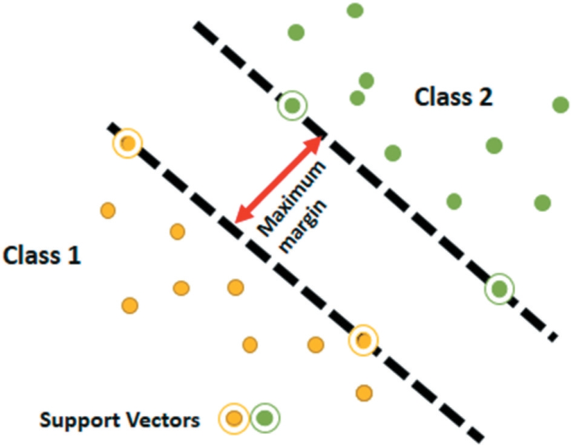

## Figure 4. Machine learning algorithms.

## Figure 5. SVM classifier.

## 

# 3.2.4. Histogram of Oriented Gradient (HOG)

Dalal và Triggs (2005) đề xuất **HOG (histogram của gradient có hướng)**, một bộ mô tả được chuẩn hóa cục bộ, đạt hiệu năng cao hơn so với các bộ mô tả đặc trưng khác (bao gồm wavelet).

- Ngay cả khi không có thông tin chính xác về gradient hay vị trí cạnh, HOG vẫn xác định được hình dạng và diện mạo của đối tượng dựa trên hướng cạnh hoặc phân bố gradient cường độ cục bộ.
- HOG chia toàn bộ ảnh thành các vùng nhỏ gọi là **cell** hoặc **region**. Các hướng gradient trên pixel hoặc histogram cục bộ 1D của gradient sẽ được tích lũy trong cell đó.
- Biểu diễn ảnh cuối cùng được tạo thành bằng cách kết hợp các histogram này.

HOG tích lũy năng lượng – là thước đo histogram cục bộ trên các **block** lớn hơn – và chuẩn hóa tất cả các cell. Nhờ đó, HOG **bất biến hơn với thay đổi ánh sáng và bóng đổ**.

Trong thập kỷ qua, HOG đã được ứng dụng rộng rãi, đặc biệt trong nhận dạng đối tượng.
**Mehmood et al. (2018):**

- Đề xuất CBIR dựa trên SURF (đặc trưng cục bộ) và HOG (đặc trưng toàn cục).
- SURF mạnh hơn trong môi trường nhiễu và ánh sáng yếu, trong khi HOG cung cấp thông tin không gian rõ ràng, cải thiện hiệu suất truy hồi.
- SURF + HOG → tạo “từ vựng hình ảnh” lớn, cải thiện kết quả truy hồi nhưng tăng chi phí tính toán.
- Áp dụng **K-means++ clustering** để giảm chiều.
- Dùng **SVM** để phân loại, thử nghiệm trên Caltech 256, Corel 1k, Corel 1.5k, Corel 5k.
- Nhược điểm: HOG không thể dùng trực tiếp cho ảnh đa phổ vì mất thông tin phổ và không gian.

---

# 3.2.5. Co-occurrence Histogram of Oriented Gradient (CoHOG)

HOG không cung cấp thông tin không gian về pixel lân cận. Để khắc phục, **CoHOG (Watanabe et al., 2010)** được đề xuất:

- CoHOG phụ thuộc vào các đặc điểm phân biệt cục bộ để giảm kích thước vector đặc trưng.
- **Baig et al. (2020):** đề xuất CBIR dựa trên CoHOG + SURF để giảm khoảng cách ngữ nghĩa, cải thiện độ chính xác (precision) và độ bao phủ (recall).
- Sử dụng **relevance feedback** để phân biệt ảnh liên quan và không liên quan.
- Thử nghiệm: Corel 1k, Corel 1.5k, Sense 15, Caltech 256 → kết quả tích cực.
- Nhược điểm: chưa kiểm chứng trên tập dữ liệu quy mô lớn.

---

# 3.2.6. Harris Corner Detector

Harris và Stephens (1988) giới thiệu **Harris detector** lần đầu vào năm 1988.

- Là bộ dò góc bền vững, dùng trong ổn định video, ghép ảnh, hiệu chỉnh camera, theo dõi đối tượng.
- Xác định điểm có biến thiên cường độ mạnh bằng cách phân tích trị riêng của ma trận tự tương quan.
- **Ưu điểm:** bền với nhiễu, thay đổi tỷ lệ, xoay.
- **Nhược điểm:** chi phí tính toán cao.

**Qin et al. (2019):**

- Đề xuất CBIR để truy hồi ảnh mã hóa từ đám mây, dùng Harris detector cải tiến kết hợp SURF.
- Sử dụng **Local Sensitive Hash (LSH)** để lập chỉ mục nhanh, giảm thời gian tìm kiếm.
- Kết quả: hiệu quả với ảnh nhỏ, nhưng khi dữ liệu lớn, hiệu năng kém.

---

# 3.2.7. FAST (Features from Accelerated Segment Test)

**FAST (Rosten et al., 2010):**

- Được phát triển để vượt qua hạn chế chi phí tính toán của Harris.
- Ưu điểm: khả năng lặp lại tốt, phát hiện điểm đặc trưng nhanh.
- **Sharmi et al. (2018):** đề xuất CBIR dựa trên FAST trong môi trường **cloud computing**.

  - Đặc trưng được mã hóa để bảo mật dữ liệu.
  - Sử dụng watermark để ngăn truy hồi trái phép.

- Nhược điểm: hoạt động kém trong nhiễu cao, phụ thuộc ngưỡng.

---

# 3.2.8. Local Structure Descriptors for CBIR

Một số mô tả cấu trúc cục bộ mới được phát triển:

- **MTSD (Zhao et al., 2016):** sử dụng cấu trúc đa xu hướng, kết hợp đặc trưng cạnh, màu và cường độ. Vector đặc trưng 137 chiều.
- **STH (Raza et al., 2019):** kết hợp thông tin màu với hướng kết cấu. Đạt kết quả tốt nhưng thiếu thông tin cường độ.
- **CPV-THF (Raza et al., 2018):** sử dụng thông tin cường độ, hướng cạnh, màu và cấu trúc không gian cục bộ. Vector đặc trưng 242 chiều.
- **DTSD (Song et al., 2018):** dựa trên phân đoạn ảnh thành tiền cảnh và hậu cảnh, dùng không gian HSV. Vector đặc trưng 692 chiều.
- **MCLTP (Agarwal et al., 2019):** mô tả nhị phân bậc ba trên không gian HSV, kết hợp 2 kênh màu. Vector đặc trưng 3072 chiều.

## Nhược điểm chung: **vector đặc trưng có số chiều lớn → tăng chi phí tính toán.**

## Figure 6. An example of CNN architecture

# 【Bảng 3】

**Đặc điểm chính, hạn chế và ví dụ của các nhóm học máy chính**

| Phương pháp                                                 | Đặc điểm chính                                                                                                          | Hạn chế                                                                               | Ví dụ                                                            |
| ----------------------------------------------------------- | ----------------------------------------------------------------------------------------------------------------------- | ------------------------------------------------------------------------------------- | ---------------------------------------------------------------- |
| **Học có giám sát (Supervised Learning – Classification)**  | - Cần nhãn dữ liệu. - Dự đoán và phân loại vào lớp xác định.                                                         | - Kích thước tập huấn luyện ảnh hưởng trực tiếp đến độ chính xác.                     | SVM, ANN                                                         |
| **Học không giám sát (Unsupervised Learning – Clustering)** | - Không cần nhãn dữ liệu. - Học sự tương đồng và ngữ nghĩa giữa dữ liệu, khái quát hóa mô hình để xử lý dữ liệu mới. | - Dễ overfitting. - Khó mở rộng quy mô. - Số lượng cụm ảnh hưởng đến hiệu suất. | K-means, K-means++                                               |
| **Học sâu (Deep Learning)**                                 | - Có thể giám sát hoặc không giám sát. - Sinh mô hình học tự động.                                                   | - Chi phí tính toán rất cao. - Cấu trúc phức tạp.                                  | CNN, Deep Neural Network, Deep Belief Network, Boltzmann Machine |

---

# 【Bảng 4】

**Tóm tắt hiệu năng của các thuật toán học máy trong CBIR**

| Tham khảo              | Thuật toán                    | Bộ dữ liệu                                  | Độ chính xác                   | Vấn đề                                                                               | Hạn chế                                                               |
| ---------------------- | ----------------------------- | ------------------------------------------- | ------------------------------ | ------------------------------------------------------------------------------------ | --------------------------------------------------------------------- |
| Yousuf et al. (2018)   | K-means, SVM                  | Corel 1k, Corel 1.5k, Caltech 256           | 0.8730, 0.8520, 0.3030         | Giảm khoảng cách ngữ nghĩa giữa đặc trưng mức cao & thấp.                            | Descriptor số chiều lớn.                                              |
| Sarwar et al. (2019)   | SVM                           | WANG 1k, WANG 1.5k, Holiday                 | 0.8958, 0.7602, 0.6923         | - Giảm khoảng cách ngữ nghĩa. - Bất biến với xoay, ánh sáng. - PCA giảm chiều. | Chưa kiểm chứng trên tập lớn. Không dùng cho ảnh đa phổ.           |
| Mehmood et al. (2018)  | K-means++, SVM                | Corel 1k, Corel 1.5k, Corel 5k, Caltech 256 | 0.8061, 0.7628, 0.6060, 0.4630 | Cung cấp thông tin không gian, hoạt động tốt trong nhiễu & ánh sáng yếu.             | HOG không dùng cho ảnh đa phổ.                                        |
| Ashraf et al. (2015)   | ANN                           | Corel, Coil, Caltech 101                    | 0.8200                         | Truy hồi dựa trên đối tượng chính trong ảnh.                                         | Phân đoạn làm chậm hệ thống.                                          |
| AlZu’bi et al. (2017)  | CNN                           | Oxford 5k, Oxford 105k                      | 0.9570, 0.8860                 | Không cần nhãn. Vector ngắn (16). Giảm bộ nhớ và thời gian.                    | Độ chính xác giảm khi dữ liệu lớn.                                    |
| Tzelepi & Tefas (2018) | CNN (giám sát/không giám sát) | Paris 6k, UKBench                           | 0.9859, 0.8347                 | Giảm chiều descriptor, giữ thông tin không gian.                                     | Thời gian truy hồi tăng.                                              |
| Q. Zheng et al. (2019) | CNN                           | Caltech 101, Holiday, Oxford                | 0.8850, 0.9410, 0.9620         | Sử dụng VGG-16, so sánh độ tương đồng.                                               | Cần tăng tốc huấn luyện, tốn thời gian xây dựng dữ liệu trọng trường. |
| Sezavar et al. (2019)  | CNN                           | Corel, ALOI, MPEG-7                         | 0.9559, 0.9706, 0.7749         | Giảm chi phí tính toán.                                                              | Thời gian truy hồi tăng nếu không dùng sparse representation.         |

---

# 【Bảng 5】

**So sánh các kỹ thuật CBIR khác nhau**

| Tham khảo                 | Phương pháp trích xuất | Độ chính xác | Điểm mạnh                                                                                                          | Hạn chế                                                       |
| ------------------------- | ---------------------- | ------------ | ------------------------------------------------------------------------------------------------------------------ | ------------------------------------------------------------- |
| Srivastava & Khare (2017) | Toàn cục               | 0.9999       | - Cung cấp thông tin hướng & không gian. - Bất biến với thay đổi tỷ lệ, xoay.                                   | Tăng độ phức tạp tính toán. DWT nhạy với nhiễu.            |
| Phadikar et al. (2018)    | Toàn cục               | 0.9850       | - Xem xét đồng thời màu, kết cấu, hình dạng. - GA tăng độ chính xác.                                            | GA làm tăng chi phí tính toán.                                |
| Sarwar et al. (2019)      | Cục bộ                 | 0.8958       | - Giảm khoảng cách ngữ nghĩa. - Bất biến với xoay, ánh sáng. - PCA giảm chiều.                               | Không thử trên tập lớn. Mất thông tin phổ và không gian.   |
| Yousuf et al. (2018)      | Cục bộ                 | 0.8730       | - Giảm khoảng cách ngữ nghĩa. - Bất biến với xoay, chiếu sáng, tỷ lệ. - Hoạt động tốt trong tương phản thấp. | Descriptor số chiều cao.                                      |
| Tzelepi & Tefas (2018)    | CNN                    | 0.9859       | - Giảm chiều descriptor. - Giữ thông tin không gian.                                                            | Thời gian truy hồi tăng.                                      |
| Sezavar et al. (2019)     | CNN                    | 0.9706       | Giảm chi phí tính toán.                                                                                            | Thời gian truy hồi tăng nếu không dùng sparse representation. |
