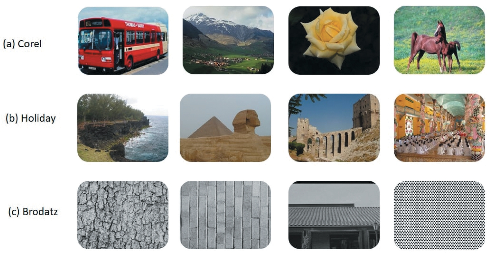

# 7. Tập dữ liệu hình ảnh (Image datasets)

Tập dữ liệu thích hợp được lựa chọn dựa trên **thuật toán**, **bài toán cần giải quyết**, và **ứng dụng cụ thể**. Trong lĩnh vực CBIR, có rất nhiều tập dữ liệu khác nhau, được phân loại theo:

- **Số lượng ảnh** mà chúng chứa,
- **Loại ảnh** (màu, xám, tự nhiên, y tế, kết cấu…),
- **Cách thức thu thập**.

Thông thường, tập dữ liệu hình ảnh bao gồm **nhiều danh mục/lớp (categories/classes)**.

- Mỗi lớp chứa các ảnh có cùng ý nghĩa ngữ nghĩa.
- Việc phân loại này thường do tác giả thực hiện, dựa trên khái niệm ngữ nghĩa.
- Phần lớn ảnh trong tập dữ liệu được **thu thập thủ công và gán nhãn**.

Tuy nhiên, khi lựa chọn tập dữ liệu, cần lưu ý một số hạn chế:

1. Do sự khác biệt về **góc nhìn** và **lớp phân loại**, một số ảnh có thể được chia thành hai nhóm khác nhau.
2. Ảnh đã gán nhãn (tagged images) **có thể bị gán sai nhãn**, làm giảm độ chính xác của hệ thống.
3. Một số ảnh được phân loại vào **các danh mục khác nhau**, mặc dù chúng có ngữ nghĩa gần như giống hệt nhau.

Vì những lý do này, việc chọn tập dữ liệu cần được cân nhắc kỹ lưỡng. Ví dụ:

- Hệ thống CBIR dựa trên **thuật toán học máy** cần một tập dữ liệu đủ lớn cho huấn luyện và kiểm thử.

---

## Các tập dữ liệu phổ biến

### Figure 7. Samples from corel, holiday, and brodatz image datasets.

- **Corel dataset:** có nhiều phiên bản: Corel 1k, Corel 1.5k, Corel 5k, và Corel 10k.

  - **Corel 1k:** 1.000 ảnh màu (kích thước 256×384 hoặc 384×256 px), chia thành 10 lớp, mỗi lớp 100 ảnh.
  - **Corel 1.5k:** 1.500 ảnh, 15 lớp, mỗi lớp 100 ảnh, cùng kích thước như Corel 1k.
  - **Corel 5k:** 5.000 ảnh màu, chia thành 50 lớp ngữ nghĩa, mỗi lớp 100 ảnh, kích thước 126×187 hoặc 187×126 px.
  - **Corel 10k:** 10.000 ảnh màu, chia thành 100 lớp ngữ nghĩa, mỗi lớp 100 ảnh, kích thước giống Corel 1k và Corel 5k.
  - Tất cả các tập Corel đều là **ảnh tự nhiên** (P. Liu et al., 2017).
  - 【Hình 7(a)】 cho thấy ví dụ từ Corel dataset.

- **Holidays dataset (Jain et al., 2011):**

  - Gồm **1.491 ảnh**, chia thành **500 lớp**, mỗi lớp có từ 2 đến 13 ảnh.
  - Được coi là tập dữ liệu **ảnh tự nhiên** (P. Liu et al., 2017).
  - 【Hình 7(b)】 minh họa một số mẫu từ tập Holidays.

- **Brodatz dataset:**

  - Là tập dữ liệu ảnh xám, chuyên về **kết cấu (textural dataset)** (P. Liu et al., 2017; Bibi et al., 2020b).
  - 【Hình 7(c)】 trình bày các ví dụ từ Brodatz.

- **IRMA dataset (Image Retrieval in Medical Applications):**

  - Là tập dữ liệu **y tế**, chứa **57 lớp**, tổng cộng **14.410 ảnh** (Shamna et al., 2019; Öztürk, 2020).
  - Chủ yếu dùng trong lĩnh vực truy hồi ảnh y khoa.

---

【Bảng 6】 trình bày các tập dữ liệu được sử dụng phổ biến nhất trong lĩnh vực CBIR.

---

👉 Bạn có muốn mình dịch tiếp nguyên văn **Bảng 6 (các tập dữ liệu phổ biến trong CBIR)** không?
